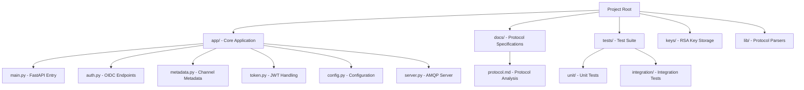
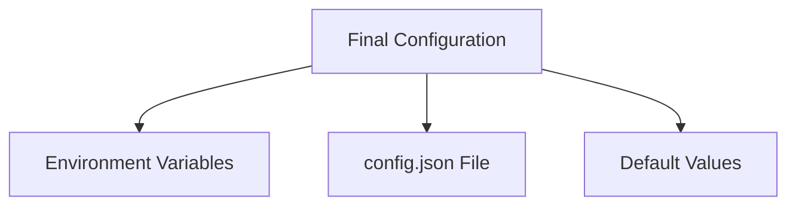

# PyESB Agent Guide

**Last Updated**: 2026-06-21  
**Version**: 2.0  
**Purpose**: Complete navigation guide for Zed coding agent

## 🎯 Project Overview

**PyESB** (1C Enterprise Service Bus Gateway) is a **FastAPI-based mock gateway** that simulates the authentication and metadata endpoints of the native 1C ESB Gateway. This project is designed for **development and testing** of 1C Enterprise integrations.

### 🎯 Key Features
- ✅ **OIDC Authentication**: `/auth/oidc/token` endpoint with JWT RS512 tokens
- ✅ **Metadata API**: `/applications/{app}/sys/esb/metadata/channels` for AMQP channel configuration
- ✅ **AMQP 1.0 Server**: Qpid Proton-based message logging server on port 6698
- ✅ **Mock Authentication**: Intentionally accepts any credentials for development convenience
- ✅ **Docker Support**: Multi-stage builds with health checks
- ✅ **Python 3.12+**: Modern async FastAPI architecture

### 🚫 Important Constraints
**⚠️ This is a MOCK gateway - NOT for production use**
- No TLS encryption (matches 1C testing behavior)
- **Any credentials are accepted** (for development only)
- AMQP server logs messages but doesn't process them
- Intentionally simplified for testing purposes

---

## 🗺️ Navigation Map



---

## 📁 Directory Structure Quick Reference

```bash
pyesb/
├── app/                    # Core FastAPI application
│   ├── __init__.py
│   ├── main.py              # FastAPI app setup & routes
│   ├── auth.py              # OIDC token endpoint
│   ├── metadata.py          # Channel metadata endpoint
│   ├── token.py             # JWT generation/verification
│   ├── config.py            # Configuration models & defaults
│   └── server.py            # AMQP server implementation
│
├── docs/                   # Documentation
│   └── protocol.md          # Protocol specification from mitm capture
│
├── tests/                  # Test suite
│   ├── unit/                # Unit tests
│   ├── integration/         # Integration tests
│   └── fixtures/            # Test data
│
├── keys/                   # RSA key storage
│   ├── private.pem          # Private key (auto-generated)
│   └── public.pem           # Public key (auto-generated)
│
├── lib/                    # Utility libraries
│   └── capture.py           # mitm capture parser
│
├── .venv/                  # Python virtual environment
├── .ruff_cache/            # Ruff linter cache
├── .pytest_cache/          # Pytest cache
└── .tmp/                   # Temporary files
```

---

## 🚀 Quick Start Commands

### 📦 Installation
```bash
# Clone the repository (if not already done)
git clone <repository-url>
cd pyesb

# Install dependencies using uv (recommended)
uv sync

# Alternative: pip install
pip install -e .
```

### 🏁 Running the Server
```bash
# Development mode (auto-reload)
python app/main.py

# Production mode (gunicorn recommended)
gunicorn app.main:app --workers 4 --bind 0.0.0.0:9090
```

### 🧪 Running Tests
```bash
# Run all tests (excluding Docker)
python -m pytest tests/ --ignore=tests/integration/test_docker_integration.py -v

# Run unit tests only
python -m pytest tests/unit/ -v

# Run integration tests only
python -m pytest tests/integration/ -v
```

### 🎯 Linting & Formatting
```bash
# Check for linting issues
ruff check app/

# Auto-format code
ruff format app/
```

### 🐳 Docker Commands
```bash
# Build and run with Docker Compose
docker-compose up -d

# Check service health
curl http://localhost:9090/health

# View logs
docker-compose logs -f app

# Stop services
docker-compose down
```

---

## 🔐 Security Architecture

### 🔑 Key Generation
```python
from cryptography.hazmat.primitives import serialization
from cryptography.hazmat.primitives.asymmetric import rsa

# Auto-generated during first run
# Stores keys in: keys/private.pem & keys/public.pem
# 2048-bit RSA keys for RS512 signing
```

### 📝 JWT Token Structure
```json
{
  "iss": "unused-issuer",
  "sub": {
    "user-id": "22af67ef-d0bd-4861-a7ed-519068ee7d68",
    "user-list-id": "099d11dd-c6d9-401d-8c63-991f21876067",
    "user-presentation": "test",
    "auth-identity": {
      "name": "<base64-sha256(client_id)>",
      "domain": "user_tokens"
    }
  },
  "aud": "<client_id>",
  "iat": 1781978834,
  "exp": 1781982434,
  "at_hash": "AccessToken hash (not implemented)"
}
```

### ⚠️ Mock Authentication Warning
```python
# THIS IS INTENTIONAL MOCK BEHAVIOR
# For development only - never use in production
def verify_credentials(client_id: str, client_secret: str) -> bool:
    # Returns True regardless of input credentials
    return True  # Mock: always accept
```

---

## 🔧 Configuration System

### Configuration Hierarchy


### Default Configuration

#### 👤 Default Clients
```python
{
    "test": {
        "client_id": "test",
        "client_secret": "test",
        "user_id": "22af67ef-d0bd-4861-a7ed-519068ee7d68",
        "user_list_id": "099d11dd-c6d9-401d-8c63-991f21876067",
        "user_presentation": "test"
    }
}
```

#### 📦 Default Applications
```python
{
    "test": [
        {
            "process": "rav::test::Основное::ПроцессИнтеграции1",
            "channel": "Канал1СНазначение",
            "access": "READ_ONLY"
        },
        {
            "process": "rav::test::Основное::ПроцессИнтеграции1",
            "channel": "Канал1СИсточник",
            "access": "WRITE_ONLY"
        }
    ]
}
```

### Environment Variables
```bash
# Override default configuration
export PYESB_CLIENTS='{"myapp":{"client_id":"myapp","client_secret":"secret123"}}'
export PYESB_APPLICATIONS='{"myapp":[{"process":"rav::myapp::MyProcess","channel":"MyChannel","access":"READ_ONLY"}]}'
```

---

## 🌐 API Endpoints

### 1. 🏥 Health Check
```bash
GET /health
```

**Response**: `{"status": "ok"}`

### 2. 🔐 OIDC Token Endpoint
```bash
POST /auth/oidc/token
Headers:
  Authorization: Basic <base64(client_id:client_secret)>
  Content-Type: application/x-www-form-urlencoded

Body:
  grant_type=client_credentials
```

**Response**:
```json
{
  "id_token": "<JWT>",
  "access_token": "Not implemented",
  "token_type": "Bearer"
}
```

### 3. 📊 Channel Metadata Endpoint
```bash
GET /applications/{app_name}/sys/esb/metadata/channels
Headers:
  Authorization: Bearer <id_token>
```

**Response**:
```json
[
  {
    "process": "rav::test::Основное::ПроцессИнтеграции1",
    "processDescription": "",
    "channel": "Канал1СНазначение",
    "channelDescription": "",
    "access": "READ_ONLY"
  }
]
```

---

## 📡 AMQP Server Architecture

### Server Components
```python
from proton import Handler, Messenger, Message

class AmqpServer(Handler):
    def __init__(self, host: str = "0.0.0.0", port: int = 6698):
        self.host = host
        self.port = port
        self.messenger = Messenger()
        self.messenger.subscribe("amqp://0.0.0.0/"
        
    def on_start(self, event):
        # Listen for incoming AMQP connections
        pass
        
    def on_message(self, event):
        # Log incoming messages
        print(f"[AMQP] Received message: {event.message}")
        
    def run(self):
        # Run in background thread
        pass
```

### Key Features
- ✅ **Non-blocking**: Runs in background thread
- ✅ **Port 6698**: Standard AMQP 1.0 port
- ✅ **Message Logging**: Logs all incoming AMQP messages
- ✅ **No Processing**: Currently only logs (intentional mock behavior)

---

## 🔍 Error Handling

### Error Response Format
```json
{
  "error": {
    "code": 5,
    "status": "NOT_FOUND",
    "message": "Application 'app_name' not found."
  }
}
```

### Common Error Codes
| Code | Status | Description |
|------|--------|-------------|
| 5 | NOT_FOUND | Application/channel not found |
| 16 | UNAUTHENTICATED | Invalid credentials (mock: never actually triggered) |

---

## 🐞 Debugging Guide

### Common Issues

#### 1. **JWT Verification Failed**
```
Error: Invalid token signature
```

**Solution**: Check that RSA keys exist in `keys/` directory
```bash
ls -la keys/
# Should show private.pem and public.pem
```

#### 2. **AMQP Server Not Responding**
```
Connection refused: port 6698
```

**Solution**: Check if AMQP server thread started properly
```bash
# Check server.py for errors
# Verify port 6698 is not blocked
netstat -tuln | grep 6698
```

#### 3. **Application Not Found**
```json
{
  "error": {
    "code": 5,
    "status": "NOT_FOUND",
    "message": "Application 'unknown' not found."
  }
}
```

**Solution**: Add application to configuration
```json
{
  "unknown": [
    {
      "process": "rav::unknown::Main::Integration",
      "channel": "UnknownChannel",
      "access": "READ_ONLY"
    }
  ]
}
```

#### 4. **Docker Container Crashes**
```
Error: Failed to generate RSA keys
```

**Solution**: Ensure volume permissions are correct
```yaml
# docker-compose.yml should have:
volumes:
  - ./keys:/app/keys
```

---

## 📚 Key Documentation Files

### 📖 Main Documentation
- `README.md` - Project overview and setup instructions
- `DOCKER_README.md` - Docker deployment guide
- `docs/protocol.md` - Protocol specification from mitm capture
- `todo.md` - Development roadmap
- `zed_agent_notes.md` - Technical analysis for coding agents

### 📄 Technical References
- `docs/protocol.md` - **Critical**: Protocol analysis from mitm capture
- `stream.bin` - Raw mitm capture data (in `docs/`)

---

## 🔮 Future Development (from todo.md)

### Planned Features
- [ ] **AMQP Message Processing**: Handle incoming messages with business logic
- [ ] **Message Forwarding**: Route messages to external systems
- [ ] **Message Persistence**: Store messages in database
- [ ] **Advanced Routing**: Support complex routing rules
- [ ] **Monitoring**: Add Prometheus metrics endpoint

### Roadmap
1. Complete AMQP message handling infrastructure
2. Add database integration for message persistence
3. Implement advanced routing and transformation
4. Add monitoring and alerting capabilities
5. Docker improvements for production deployment

---

## 🔗 External Dependencies

### Python Packages
```toml
# pyproject.toml dependencies
fastapi >= 0.115.0
uvicorn >= 0.29.0
python-jose[cryptography] >= 3.3.0
pydantic >= 2.8.0
proton >= 0.31.0
cryptography >= 42.0.0
python-multipart >= 0.0.6
```

### System Dependencies
- Python 3.12+
- Docker (for containerized deployment)
- Docker Compose (for multi-container environments)

---

## 🎯 Common Workflows

### 1. **Add a New Application**
```python
# In config.py, add to DEFAULT_APPLICATIONS
DEFAULT_APPLICATIONS = {
    "newapp": [
        {
            "process": "rav::newapp::Main::Integration",
            "channel": "NewChannel",
            "access": "READ_ONLY"
        }
    ]
}
```

### 2. **Add a New Client**
```python
# In config.py, add to DEFAULT_CLIENTS
DEFAULT_CLIENTS = {
    "newclient": {
        "client_id": "newclient",
        "client_secret": "secret123",
        "user_id": "a1b2c3d4-5678-90ef-ghij-klmnopqrstuv",
        "user_list_id": "b2c3d4e5-6789-01fg-hiij-klmnopqrstuv",
        "user_presentation": "New Client"
    }
}
```

### 3. **Modify JWT Claims**
```python
# In token.py, edit create_jwt_token function
def create_jwt_token(client_id: str, client_config: dict) -> str:
    # Add custom claims here
    claims = {
        "custom_field": "custom_value",
        "sub": {
            # Existing sub claims...
        }
    }
    # ... rest of JWT generation
```

### 4. **Enhance AMQP Server**
```python
# In server.py, modify on_message method
class AmqpServer(Handler):
    def on_message(self, event):
        # Current: just logging
        print(f"[AMQP] Received message: {event.message}")
        
        # Future: add processing logic
        message_data = event.message.body
        if message_data:
            # Process message and route to external system
