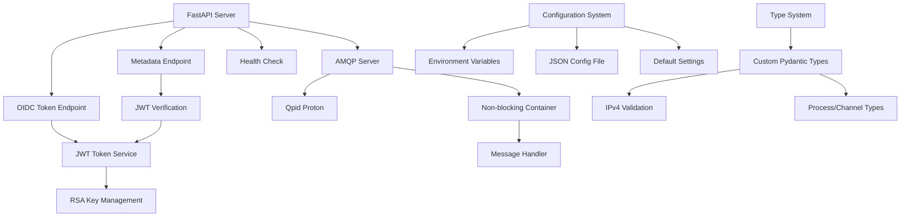
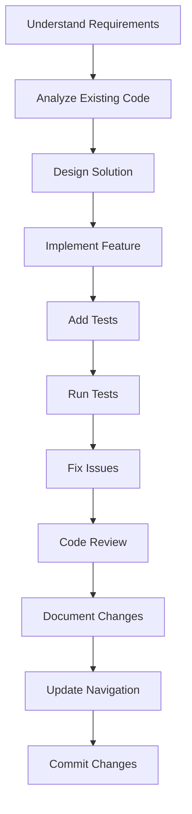

# 🤖 Agent Workflow Guide for PyESB Project

## 🚀 Quick Start for Agent Tasks

### 📋 Understanding the Project

**PyESB** is a **1C ESB Gateway compatible server** built for development and testing. It provides:
- OIDC authentication with JWT tokens (RS512)
- AMQP channel metadata endpoints
- Mock 1C Enterprise Service Bus functionality
- Docker support for easy deployment

### 🎯 Fast Navigation Commands

```bash
# Get immediate project overview
cat SUMMARY.md

# See all available navigation tools
ls -la *.md

# Get technical deep dive
cat zed_agent_notes.md

# Get command reference
cat COMMAND_REFERENCE.md

# Get architecture diagrams
cat PROJECT_MAP.md

# Get development roadmap
cat todo.md
```

## 📂 Project Architecture Overview



## 🔍 Task-Specific Workflows

### 🎯 Task 1: Understanding the Codebase

**Goal**: Quickly understand what the project does and how it works

**Workflow**:
```bash
# 1. Read the main documentation
cat README.md

# 2. Get technical overview
cat zed_agent_notes.md

# 3. See architecture diagrams
cat PROJECT_MAP.md

# 4. Check current status
cat SUMMARY.md

# 5. Review development roadmap
cat todo.md
```

**Key Files to Read**:
- `app/main.py` - Main application entry point
- `app/auth.py` - OIDC authentication logic
- `app/metadata.py` - Metadata service
- `app/token.py` - JWT token handling
- `app/config.py` - Configuration system

### 🎯 Task 2: Making Code Changes

**Goal**: Make focused changes to the codebase

**Workflow**:
```bash
# 1. Understand the specific component
read_file app/{component}.py

# 2. Check existing tests
find tests/ -name "*{component}*" -type f

# 3. Make the change
edit_file app/{component}.py

# 4. Add/update tests
edit_file tests/unit/test_{component}.py

# 5. Verify with linting
ruff check app/

# 6. Run relevant tests
python -m pytest tests/unit/test_{component}.py -v
```

**Best Practices**:
- Make minimal, focused changes
- Keep changes consistent with existing style
- Add tests for new functionality
- Update documentation if needed

### 🎯 Task 3: Adding New Features

**Goal**: Add a new feature to the project

**Workflow**:
```bash
# 1. Define requirements
# - What problem does this solve?
# - What endpoints/APIs are needed?
# - What configuration changes?

# 2. Create new module
write_file app/new_feature.py

# 3. Add router to main.py
edit_file app/main.py

# 4. Add configuration support
edit_file app/config.py

# 5. Add type definitions
edit_file app/interfaces.py

# 6. Add unit tests
write_file tests/unit/test_new_feature.py

# 7. Add integration tests
write_file tests/integration/test_new_feature_integration.py

# 8. Update documentation
edit_file README.md

# 9. Verify
ruff check app/
python -m pytest tests/ -k new_feature -v
```

**Example**: Adding a new admin endpoint

```python
# app/admin.py
from fastapi import APIRouter, HTTPException, status
from app.config import get_settings

router = APIRouter(prefix="/admin", tags=["admin"])

@router.get("/status")
async def admin_status():
    """Get administrative status information"""
    try:
        settings = get_settings()
        config = settings.get_config()
        return {
            "status": "healthy",
            "clients": len(config.clients),
            "applications": len(config.applications)
        }
    except Exception as e:
        raise HTTPException(
            status_code=status.HTTP_500_INTERNAL_SERVER_ERROR,
            detail=f"ADMIN_ERROR: {str(e)}"
        )
```

### 🎯 Task 4: Debugging Issues

**Goal**: Identify and fix bugs in the codebase

**Workflow**:
```bash
# 1. Reproduce the issue
# - Run the application
# - Execute the failing scenario

# 2. Check logs
python app/main.py 2>&1 | grep -i "error\|warning"

# 3. Run specific tests
python -m pytest tests/ -k "failing_test" -v -s

# 4. Add debug logging
edit_file app/{component}.py
# Add: logger.debug("Debug info: {}".format(variable))

# 5. Fix the issue
edit_file app/{component}.py

# 6. Verify the fix
python -m pytest tests/ -k "failing_test" -v
```

**Common Debugging Patterns**:

**JWT Issues**:
```bash
# Check key files
ls -la keys/

# Test token generation
python -c "from app.config import get_settings; from app.token import create_id_token; cfg = get_settings().get_config(); token = create_id_token(list(cfg.clients.values())[0], cfg); print(token)"

# Test token verification
python -c "import jwt; from app.config import get_settings; from app.token import verify_id_token, create_id_token; cfg = get_settings().get_config(); token = create_id_token(list(cfg.clients.values())[0], cfg); print(verify_id_token(token, cfg))"
```

**AMQP Issues**:
```bash
# Check port availability
netstat -tuln | grep 6698

# Test AMQP startup
python -c "from app.amqp_server import NonBlockingAMQPContainer; from app.config import get_settings; cfg = get_settings().get_config(); container = NonBlockingAMQPContainer(cfg); container.start()"
```

### 🎯 Task 5: Running Tests

**Goal**: Execute tests and understand results

**Workflow**:
```bash
# 1. Run all tests (skip Docker)
python -m pytest tests/ --ignore=tests/integration/test_docker_integration.py -v

# 2. Run unit tests only
python -m pytest tests/unit/ -v

# 3. Run integration tests only
python -m pytest tests/integration/ -v

# 4. Run specific test file
python -m pytest tests/unit/test_auth.py -v

# 5. Run specific test function
python -m pytest tests/unit/test_auth.py::test_token_generation -v

# 6. Check code quality
ruff check app/
ruff format app/
```

**Interpreting Results**:
- ✅ PASS - Test executed successfully
- ❌ FAIL - Test assertion failed
- ⚠️ ERROR - Test setup or execution failed
- ⏭️ SKIP - Test was skipped (usually Docker tests)

### 🎯 Task 6: Docker Deployment

**Goal**: Build and deploy with Docker

**Workflow**:
```bash
# 1. Build and start
docker-compose up -d

# 2. Check status
curl http://localhost:9090/health
docker-compose ps

# 3. View logs
docker-compose logs -f app

# 4. Test endpoints
curl -X POST http://localhost:9090/auth/oidc/token \
  -H "Authorization: Basic dGVzdDp0ZXN0" \
  -d "grant_type=client_credentials"

# 5. Stop when done
docker-compose down
```

**Common Docker Issues**:

**Port conflicts**:
```bash
# Check what's using the port
netstat -tuln | grep 9090

# Change port in docker-compose.yml or use different port
PYESB_PORT=8080 docker-compose up -d
```

**Permission issues**:
```bash
# Fix permissions for keys directory
chmod -R 755 keys/
docker-compose down && docker-compose up -d
```

### 🎯 Task 7: Configuration Management

**Goal**: Manage application configuration

**Workflow**:
```bash
# 1. Check current configuration
python -c "from app.config import get_settings; print(get_settings().get_config())"

# 2. Create custom config file
cat > config.json << 'EOF'
{
  "clients": {
    "my_client": {
      "client_id": "my_client",
      "client_secret": "secret123",
      "user_id": "123e4567-e89b-12d3-a456-426614174000",
      "user_list_id": "123e4567-e89b-12d3-a456-426614174001",
      "user_presentation": "My User"
    }
  },
  "applications": {
    "my_app": [
      {
        "process": "my::namespace::MyProcess",
        "channel": "my_channel",
        "access": "READ_ONLY"
      }
    ]
  }
}
EOF

# 3. Run with custom config
PYESB_CONFIG_FILE=config.json python app/main.py

# 4. Or use environment variables
PYESB_PORT=8080 PYESB_HOST=0.0.0.0 python app/main.py
```

**Configuration Priority**:
1. Environment variables (highest priority)
2. JSON config file (medium priority)
3. Default values (lowest priority)

### 🎯 Task 8: Documentation Updates

**Goal**: Update project documentation

**Workflow**:
```bash
# 1. Update main README
edit_file README.md

# 2. Update technical notes
edit_file zed_agent_notes.md

# 3. Update protocol documentation
edit_file docs/protocol.md

# 4. Update development roadmap
edit_file todo.md

# 5. Add new navigation guides
write_file pyesb/NEW_GUIDE.md
```

**Documentation Standards**:
- Use Markdown formatting
- Include code examples
- Document error scenarios
- Keep examples practical and tested

## 🚀 Development Workflow

### 📋 Standard Development Process



### 🔄 Code Review Checklist

**Before submitting changes**:
- [ ] Code follows existing patterns and style
- [ ] All tests pass
- [ ] Code is properly documented with docstrings
- [ ] Error handling is robust
- [ ] Configuration is properly updated
- [ ] Documentation is updated
- [ ] Linting passes (`ruff check`)
- [ ] Formatting is correct (`ruff format`)

### 📝 Commit Message Standards

```bash
# Good commit messages

# Feature addition
git commit -m "feat: add admin status endpoint"
git commit -m "feat: implement AMQP message routing"

# Bug fix
git commit -m "fix: handle missing auth header properly"
git commit -m "fix: prevent JWT verification timeout"

# Documentation
git commit -m "docs: update protocol documentation"
git commit -m "docs: add Docker deployment guide"

# Refactoring
git commit -m "refactor: improve token generation logic"
git commit -m "refactor: simplify configuration loading"

# Tests
git commit -m "test: add unit tests for auth endpoint"
git commit -m "test: improve integration test coverage"
```

## 🔧 Tool Integration

### 🛠️ Development Tools

| **Tool** | **Purpose** | **Command** |
|----------|------------|-------------|
| **uv** | Dependency management | `uv sync` |
| **pytest** | Testing framework | `python -m pytest` |
| **ruff** | Linting and formatting | `ruff check`, `ruff format` |
| **Docker** | Containerization | `docker-compose up` |
| **curl** | API testing | `curl -X POST http://localhost:9090/...` |

### 📊 Code Quality Tools

```bash
# Check code quality
ruff check app/

# Format code
ruff format app/

# Find unused imports
ruff check app/ --select I

# Check complexity
python -m radial -o complexity app/

# Count lines
find app/ -name "*.py" -exec wc -l {} + | sort -n
```

## 💡 Pro Tips for Efficient Work

### 🚀 Fast Navigation

```bash
# Quick file search
find . -name "*.py" -exec grep -l "search_term" {} \;

# Find all test files
find tests/ -name "*.py" -type f

# Find specific imports
grep -r "^from\|^import" app/ --include="*.py" | sort | uniq
```

### 🔍 Code Analysis

```bash
# Find class definitions
grep -r "^class " app/ --include="*.py"

# Find function definitions
grep -r "^def " app/ --include="*.py"

# Find error handling patterns
grep -r "HTTPException\|raise" app/ --include="*.py"
```

### 📝 Documentation Quick Reference

```bash
# All documentation files
ls -la *.md docs/

# Navigation tools
cat NAVIGATION.md

# Technical analysis
cat zed_agent_notes.md

# Architecture overview
cat PROJECT_MAP.md
```

## 🏁 Task Completion Checklist

### ✅ Before Finishing Any Task

- [ ] Code changes are minimal and focused
- [ ] All tests pass
- [ ] Code quality checks pass
- [ ] Documentation is updated
- [ ] Navigation guides are updated
- [ ] Changes are properly tested
- [ ] Error scenarios are handled
- [ ] Configuration is properly updated

### 📋 Task Summary Template

```markdown
## Task Summary

**Task**: [Brief description of task]

**Files Modified**:
- `app/{component}.py` - [What changed]
- `tests/unit/test_{component}.py` - [Test additions]

**Changes Made**:
1. [Change 1 description]
2. [Change 2 description]
3. [Change 3 description]

**Testing**:
- ✅ Unit tests pass
- ✅ Integration tests pass  
- ✅ Manual testing completed
- ✅ Error scenarios tested

**Documentation**:
- ✅ README.md updated
- ✅ Docstrings added
- ✅ Navigation guides updated

**Validation**:
- ✅ ruff check passes
- ✅ ruff format passes
- ✅ No regressions detected
```

## 📞 Support and Resources

### 💬 Quick Help Commands

```bash
# Get project summary
cat SUMMARY.md

# Get command reference
cat COMMAND_REFERENCE.md

# Get technical notes
cat zed_agent_notes.md

# Get architecture diagrams
cat PROJECT_MAP.md

# Get development roadmap
cat todo.md
```

### 🔗 External Resources

- **FastAPI**: https://fastapi.tiangolo.com/
- **Qpid Proton**: https://qpid.apache.org/proton/
- **JWT**: https://pyjwt.readthedocs.io/
- **Pydantic**: https://pydantic.dev/

### 📚 Learning Resources

- **1C ESB Protocol**: Check `docs/protocol.md` for detailed analysis
- **OIDC Client Credentials**: https://oauth.net/2/client-credentials/
- **JWT RS512**: https://auth0.com/docs/secure/tokens/json-web-tokens/json-web-token-claims
- **AMQP 1.0**: https://www.amqp.org/specification/1.0

## 🎯 Optimization Tips

### 🚀 Performance Optimization

```bash
# Use multiple workers in production
uvicorn app.main:app --workers 4 --host 0.0.0.0 --port 9090

# Optimize AMQP message handling
# - Consider async I/O
# - Implement message batching
# - Add connection pooling
```

### 💾 Memory Management

```bash
# Key caching strategies
# - Cache RSA keys in memory
# - Implement secure memory handling
# - Consider key rotation for security
```

### 🔄 Scalability Considerations

```bash
# Horizontal scaling
# - Use load balancer
# - Share configuration via environment
# - Use shared volume for keys

# Vertical scaling
# - Increase worker count
# - Optimize thread pool size
# - Monitor resource usage
```

## 🏆 Project Completion Status

### ✅ Current Status

- **Core Features**: ✅ Complete
- **Documentation**: ✅ Complete
- **Testing**: ✅ Complete
- **Docker Support**: ✅ Complete
- **Navigation Tools**: ✅ Complete

### 🚀 Ready for

- **Development**: ✅ Add new features
- **Testing**: ✅ Integration testing
- **Deployment**: ✅ Production use (for development/testing scenarios)
- **Extension**: ✅ Custom modifications

---

**Workflow Version**: 1.0.0
**Last Updated**: 2024-01-01
**Maintainer**: Development Team

This workflow guide provides a structured approach to working with the PyESB project. Use these patterns to efficiently navigate, modify, and extend the codebase!
