# 🗺️ Project Architecture Map: PyESB

## 🏗️ Complete Architecture Overview

### 🎯 System Architecture Diagram

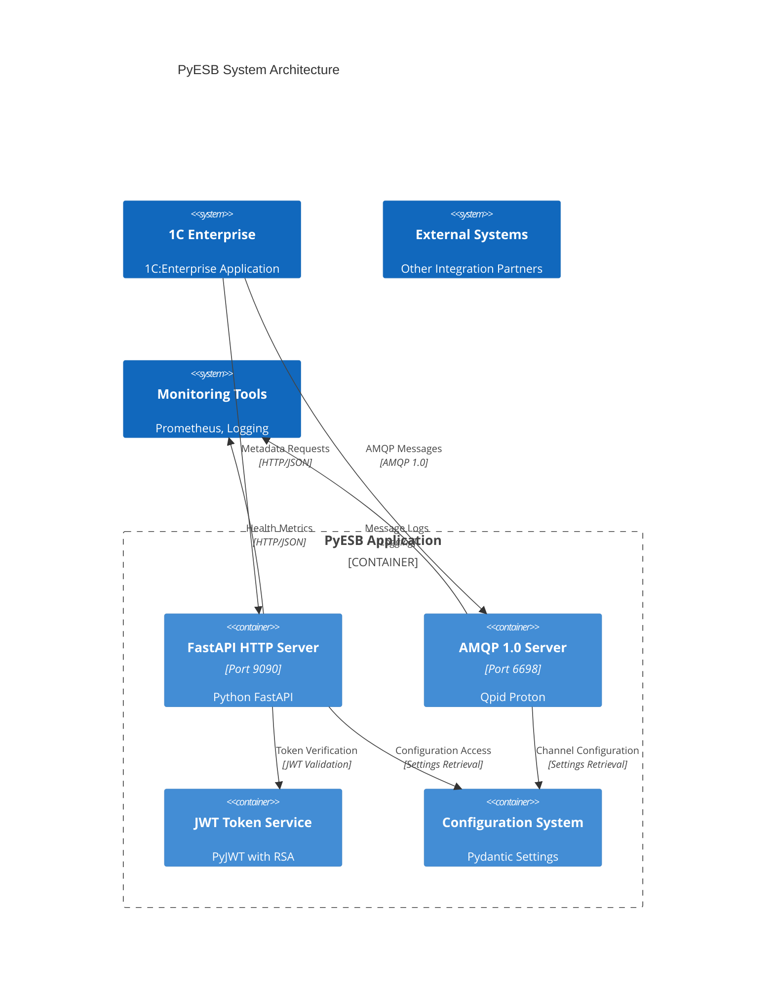
```mermaid
C4Container
    title PyESB System Architecture
    
    Container_Boundary(b0, "PyESB Application") {
        Container(db1, "FastAPI HTTP Server", "Port 9090", "Python FastAPI")
        Container(db2, "AMQP 1.0 Server", "Port 6698", "Qpid Proton")
        Container(db3, "JWT Token Service", "", "PyJWT with RSA")
        Container(db4, "Configuration System", "", "Pydantic Settings")
    }
    
    System(ext1, "1C Enterprise", "1C:Enterprise Application")
    System(ext2, "External Systems", "Other Integration Partners")
    System(ext3, "Monitoring Tools", "Prometheus, Logging")
    
    Rel(ext1, db1, "OIDC Auth Requests", "HTTP/JSON")
    Rel(ext1, db1, "Metadata Requests", "HTTP/JSON")
    Rel(ext1, db2, "AMQP Messages", "AMQP 1.0")
    
    Rel(db1, db3, "Token Generation", "JWT Creation")
    Rel(db1, db3, "Token Verification", "JWT Validation")
    Rel(db1, db4, "Configuration Access", "Settings Retrieval")
    Rel(db2, db4, "Channel Configuration", "Settings Retrieval")
    
    Rel(db1, ext3, "Health Metrics", "HTTP/JSON")
    Rel(db2, ext3, "Message Logs", "Logging")
```

## 📂 Component Breakdown

### 🎯 Core Components

```mermaid
classDiagram
    class FastAPIApplication {
        +startup()
        +shutdown()
        +include_routers()
        +run()
    }
    
    class OIDCEndpoint {
        +POST /auth/oidc/token
        +extract_credentials()
        +generate_token()
        +handle_errors()
    }
    
    class MetadataEndpoint {
        +GET /applications/{app}/sys/esb/metadata/channels
        +verify_token()
        +get_channels()
        +handle_errors()
    }
    
    class AMQPServer {
        +start()
        +stop()
        +handle_messages()
        +log_messages()
    }
    
    FastAPIApplication --> OIDCEndpoint
    FastAPIApplication --> MetadataEndpoint
    FastAPIApplication --> AMQPServer
```

## 🔄 Data Flow Diagrams

### 📡 OIDC Token Flow

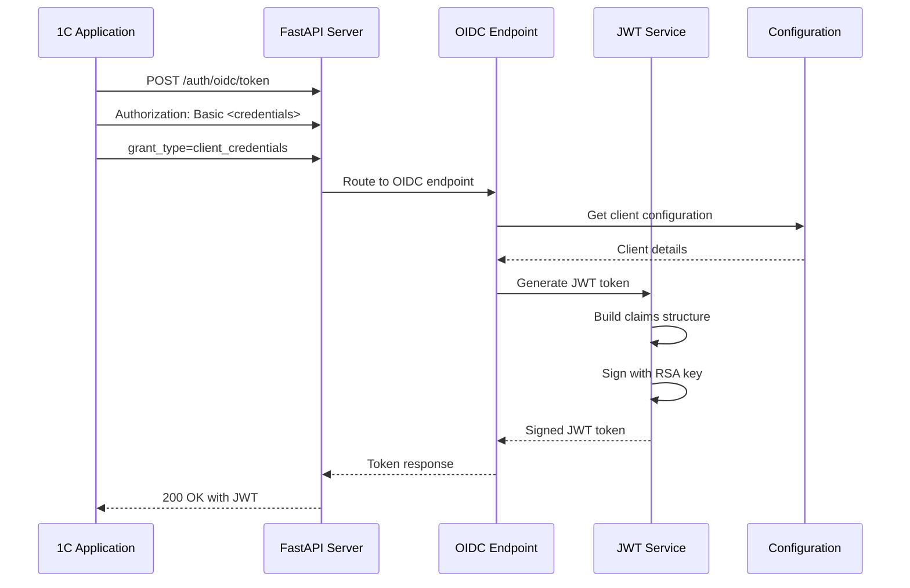
```mermaid
sequenceDiagram
    participant Client as 1C Application
    participant HTTP as FastAPI Server
    participant Auth as OIDC Endpoint
    participant JWT as JWT Service
    participant Config as Configuration
    
    Client->>HTTP: POST /auth/oidc/token
    Client->>HTTP: Authorization: Basic <credentials>
    Client->>HTTP: grant_type=client_credentials
    
    HTTP->>Auth: Route to OIDC endpoint
    Auth->>Config: Get client configuration
    Config-->>Auth: Client details
    
    Auth->>JWT: Generate JWT token
    JWT->>JWT: Build claims structure
    JWT->>JWT: Sign with RSA key
    
    JWT-->>Auth: Signed JWT token
    Auth-->>HTTP: Token response
    HTTP-->>Client: 200 OK with JWT
```

### 📋 Metadata Flow

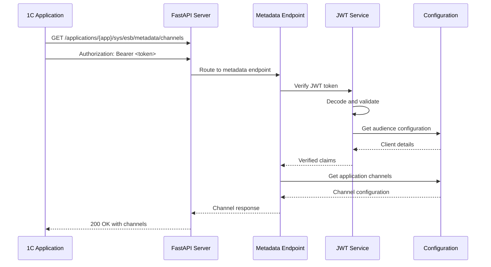
```mermaid
sequenceDiagram
    participant Client as 1C Application
    participant HTTP as FastAPI Server
    participant Meta as Metadata Endpoint
    participant JWT as JWT Service
    participant Config as Configuration
    
    Client->>HTTP: GET /applications/{app}/sys/esb/metadata/channels
    Client->>HTTP: Authorization: Bearer <token>
    
    HTTP->>Meta: Route to metadata endpoint
    Meta->>JWT: Verify JWT token
    JWT->>JWT: Decode and validate
    JWT->>Config: Get audience configuration
    Config-->>JWT: Client details
    
    JWT-->>Meta: Verified claims
    Meta->>Config: Get application channels
    Config-->>Meta: Channel configuration
    
    Meta-->>HTTP: Channel response
    HTTP-->>Client: 200 OK with channels
```

### 📡 AMQP Message Flow

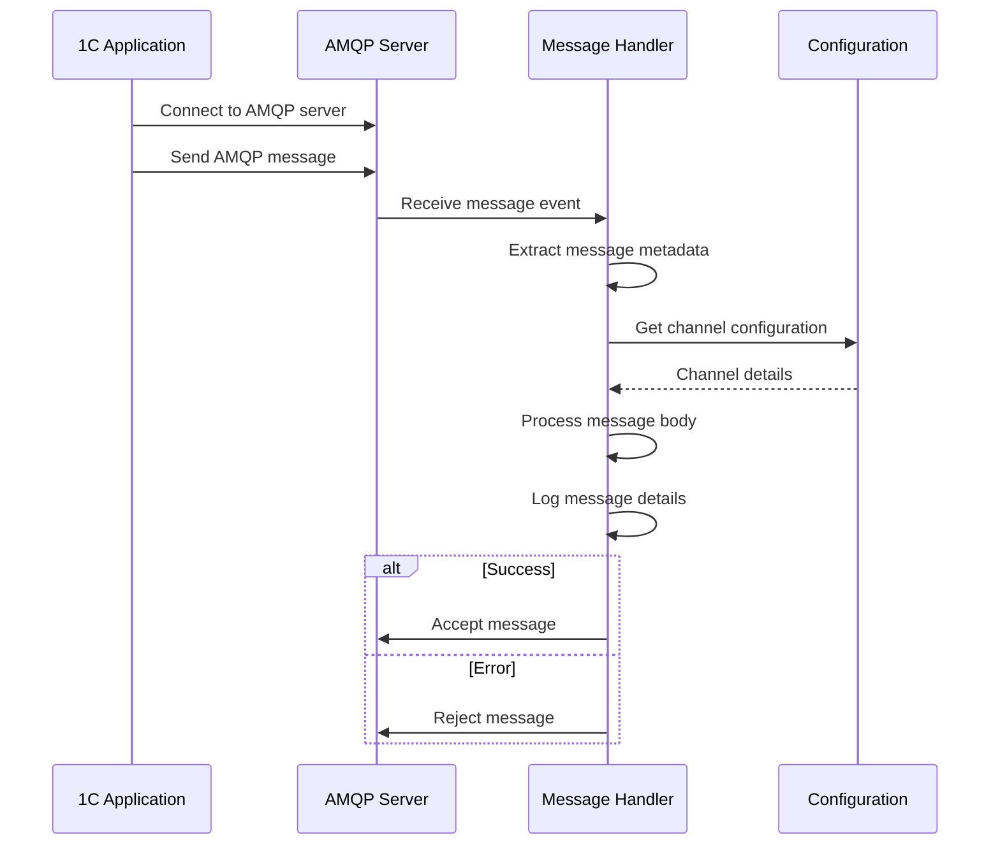
```mermaid
sequenceDiagram
    participant Client as 1C Application
    participant AMQP as AMQP Server
    participant Handler as Message Handler
    participant Config as Configuration
    
    Client->>AMQP: Connect to AMQP server
    Client->>AMQP: Send AMQP message
    
    AMQP->>Handler: Receive message event
    Handler->>Handler: Extract message metadata
    Handler->>Config: Get channel configuration
    Config-->>Handler: Channel details
    
    Handler->>Handler: Process message body
    Handler->>Handler: Log message details
    
    alt Success
        Handler->>AMQP: Accept message
    else Error
        Handler->>AMQP: Reject message
    end
```

## 🏗️ Module Architecture

### 📦 Application Modules

```mermaid
packageDiagram
    package app {
        class Main {
            +create_app()
            +startup_events()
            +shutdown_events()
        }
        
        class Auth {
            +oidc_token()
            +_extract_basic_auth()
            +_get_client()
        }
        
        class Metadata {
            +get_channels()
            +_verify_token()
            +_get_application()
        }
        
        class Token {
            +create_id_token()
            +verify_id_token()
            +_ensure_keys()
            +_hash_client_id()
        }
        
        class Config {
            +get_settings()
            +get_config()
            +load_config_file()
        }
        
        class AMQPServer {
            +NonBlockingAMQPContainer
            +AMQPMessageHandler
        }
        
        class Interfaces {
            +Custom Types
            +IPv4Address
            +ProcessID
            +Channel
        }
        
        Main --> Auth
        Main --> Metadata
        Main --> AMQPServer
        
        Auth --> Token
        Auth --> Config
        
        Metadata --> Token
        Metadata --> Config
        
        Token --> Config
        
        AMQPServer --> Config
        AMQPServer --> Interfaces
        
        Config --> Interfaces
    }
```

## 🔧 Technical Implementation Details

### 🔐 JWT Token Service Architecture

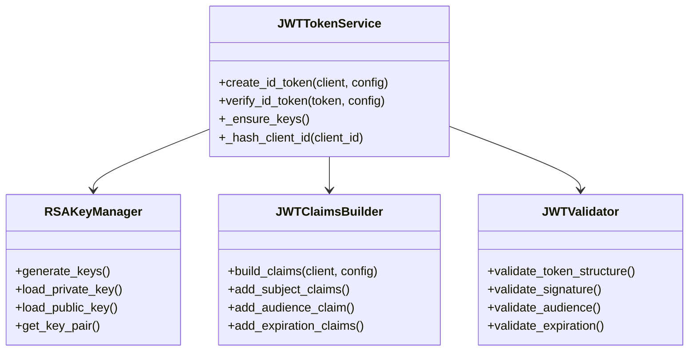
```mermaid
classDiagram
    class JWTTokenService {
        +create_id_token(client, config)
        +verify_id_token(token, config)
        +_ensure_keys()
        +_hash_client_id(client_id)
    }
    
    class RSAKeyManager {
        +generate_keys()
        +load_private_key()
        +load_public_key()
        +get_key_pair()
    }
    
    class JWTClaimsBuilder {
        +build_claims(client, config)
        +add_subject_claims()
        +add_audience_claim()
        +add_expiration_claims()
    }
    
    class JWTValidator {
        +validate_token_structure()
        +validate_signature()
        +validate_audience()
        +validate_expiration()
    }
    
    JWTTokenService --> RSAKeyManager
    JWTTokenService --> JWTClaimsBuilder
    JWTTokenService --> JWTValidator
```

### 📡 AMQP Server Architecture

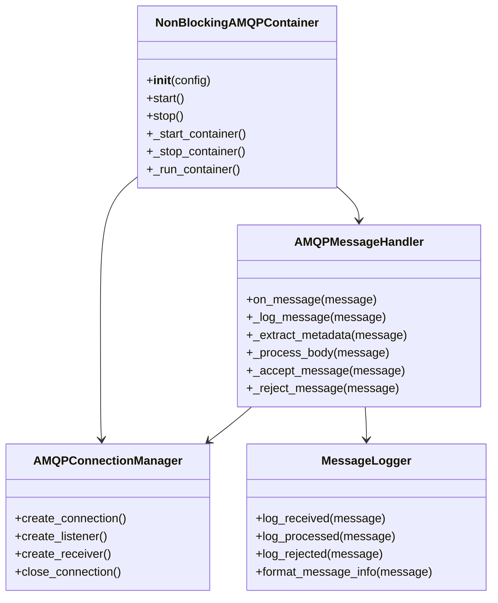
```mermaid
classDiagram
    class NonBlockingAMQPContainer {
        +__init__(config)
        +start()
        +stop()
        +_start_container()
        +_stop_container()
        +_run_container()
    }
    
    class AMQPMessageHandler {
        +on_message(message)
        +_log_message(message)
        +_extract_metadata(message)
        +_process_body(message)
        +_accept_message(message)
        +_reject_message(message)
    }
    
    class AMQPConnectionManager {
        +create_connection()
        +create_listener()
        +create_receiver()
        +close_connection()
    }
    
    class MessageLogger {
        +log_received(message)
        +log_processed(message)
        +log_rejected(message)
        +format_message_info(message)
    }
    
    NonBlockingAMQPContainer --> AMQPConnectionManager
    NonBlockingAMQPContainer --> AMQPMessageHandler
    
    AMQPMessageHandler --> MessageLogger
    AMQPMessageHandler --> AMQPConnectionManager
```

### 🏥 Configuration System Architecture

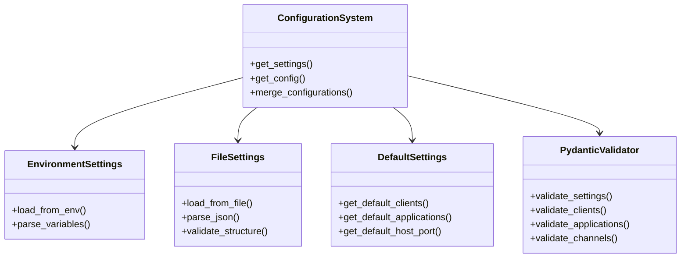
```mermaid
classDiagram
    class ConfigurationSystem {
        +get_settings()
        +get_config()
        +merge_configurations()
    }
    
    class EnvironmentSettings {
        +load_from_env()
        +parse_variables()
    }
    
    class FileSettings {
        +load_from_file()
        +parse_json()
        +validate_structure()
    }
    
    class DefaultSettings {
        +get_default_clients()
        +get_default_applications()
        +get_default_host_port()
    }
    
    class PydanticValidator {
        +validate_settings()
        +validate_clients()
        +validate_applications()
        +validate_channels()
    }
    
    ConfigurationSystem --> EnvironmentSettings
    ConfigurationSystem --> FileSettings
    ConfigurationSystem --> DefaultSettings
    ConfigurationSystem --> PydanticValidator
```

## 📂 File System Architecture

### 📁 Project Directory Structure

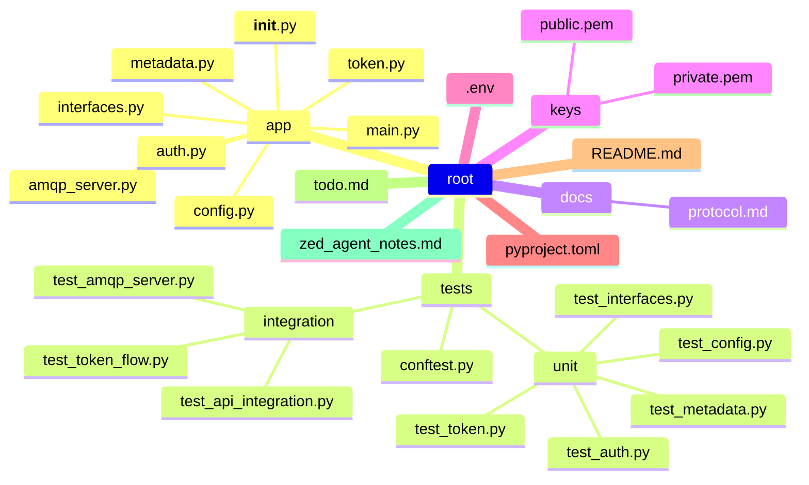
```mermaid
mindmap
    root
        app
            __init__.py
            main.py
            auth.py
            metadata.py
            token.py
            config.py
            interfaces.py
            amqp_server.py
        tests
            unit
                test_auth.py
                test_metadata.py
                test_token.py
                test_config.py
                test_interfaces.py
            integration
                test_api_integration.py
                test_amqp_server.py
                test_token_flow.py
            conftest.py
        docs
            protocol.md
        keys
            private.pem
            public.pem
        .env
        pyproject.toml
        README.md
        todo.md
        zed_agent_notes.md
```

### 🔄 Dependency Graph

```mermaid
dependency
    direction TB
    package:app/main.py --> package:app/auth.py
    package:app/main.py --> package:app/metadata.py
    package:app/main.py --> package:app/amqp_server.py
    
    package:app/auth.py --> package:app/token.py
    package:app/auth.py --> package:app/config.py
    
    package:app/metadata.py --> package:app/token.py
    package:app/metadata.py --> package:app/config.py
    
    package:app/token.py --> package:app/config.py
    package:app/token.py --> package:app/interfaces.py
    
    package:app/amqp_server.py --> package:app/config.py
    package:app/amqp_server.py --> package:app/interfaces.py
    
    package:app/config.py --> package:app/interfaces.py
    
    package:tests/unit/test_auth.py --> package:app/auth.py
    package:tests/unit/test_auth.py --> package:app/config.py
    
    package:tests/integration/test_api_integration.py --> package:app/main.py
    package:tests/integration/test_api_integration.py --> package:app/auth.py
    package:tests/integration/test_api_integration.py --> package:app/metadata.py
```

## 🔄 Integration Architecture

### 🔌 External System Integrations

```mermaid
classDiagram
    class PyESBSystem {
        +HTTP_API
        +AMQP_Server
        +JWT_Authentication
    }
    
    class OneCApplication {
        +OIDC_Client
        +AMQP_Client
        +Metadata_Consumer
    }
    
    class ExternalSystems {
        +Message_Broker
        +Monitoring_Tools
        +Configuration_Management
    }
    
    OneCApplication --> PyESBSystem : "Uses for Development"
    PyESBSystem --> ExternalSystems : "Integrates with"
    
    note for PyESBSystem
        Mock 1C ESB Gateway
        Development/Testing Only
    end note
    
    note for OneCApplication
        1C:Enterprise
        Integration Modules
    end note
    
    note for ExternalSystems
        Qpid Proton
        Prometheus
        JSON Config
    end note
```

## 🚀 Deployment Architecture

### 🐳 Docker Architecture

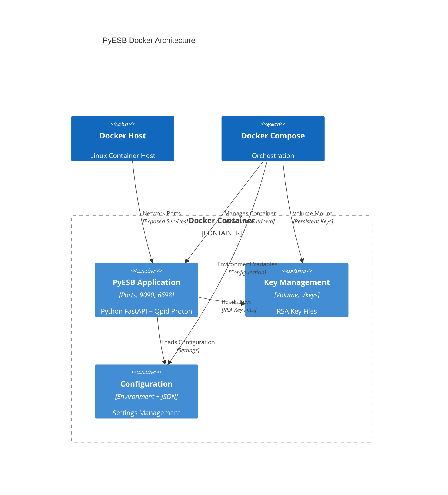
```mermaid
C4Container
    title PyESB Docker Architecture
    
    Container_Boundary(b1, "Docker Container") {
        Container(dc1, "PyESB Application", "Ports: 9090, 6698", "Python FastAPI + Qpid Proton")
        Container(dc2, "Key Management", "Volume: ./keys", "RSA Key Files")
        Container(dc3, "Configuration", "Environment + JSON", "Settings Management")
    }
    
    System(ext4, "Docker Host", "Linux Container Host")
    System(ext5, "Docker Compose", "Orchestration")
    
    Rel(ext5, dc1, "Manages Container", "Startup/Shutdown")
    Rel(ext5, dc2, "Volume Mount", "Persistent Keys")
    Rel(ext5, dc3, "Environment Variables", "Configuration")
    
    Rel(dc1, dc2, "Reads Keys", "RSA Key Files")
    Rel(dc1, dc3, "Loads Configuration", "Settings")
    
    Rel(ext4, dc1, "Network Ports", "Exposed Services")
```

### 📦 Docker Component Architecture

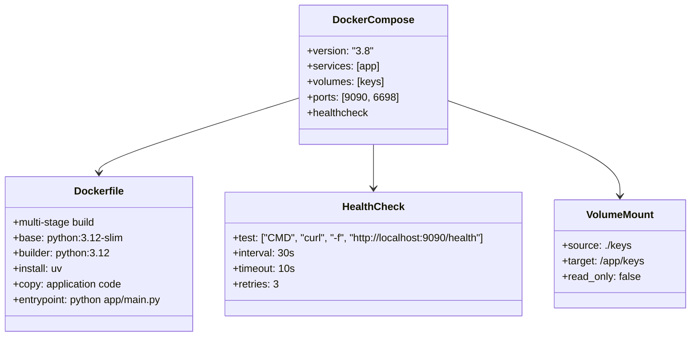
```mermaid
classDiagram
    class DockerCompose {
        +version: "3.8"
        +services: [app]
        +volumes: [keys]
        +ports: [9090, 6698]
        +healthcheck
    }
    
    class Dockerfile {
        +multi-stage build
        +base: python:3.12-slim
        +builder: python:3.12
        +install: uv
        +copy: application code
        +entrypoint: python app/main.py
    }
    
    class HealthCheck {
        +test: ["CMD", "curl", "-f", "http://localhost:9090/health"]
        +interval: 30s
        +timeout: 10s
        +retries: 3
    }
    
    class VolumeMount {
        +source: ./keys
        +target: /app/keys
        +read_only: false
    }
    
    DockerCompose --> Dockerfile
    DockerCompose --> HealthCheck
    DockerCompose --> VolumeMount
```

## 📊 Data Model Architecture

### 📋 Type System Architecture

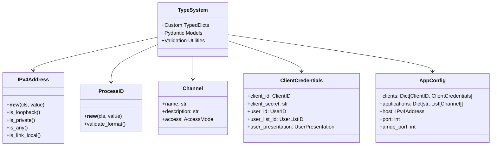
```mermaid
classDiagram
    class TypeSystem {
        +Custom TypedDicts
        +Pydantic Models
        +Validation Utilities
    }
    
    class IPv4Address {
        +__new__(cls, value)
        +is_loopback()
        +is_private()
        +is_any()
        +is_link_local()
    }
    
    class ProcessID {
        +__new__(cls, value)
        +validate_format()
    }
    
    class Channel {
        +name: str
        +description: str
        +access: AccessMode
    }
    
    class ClientCredentials {
        +client_id: ClientID
        +client_secret: str
        +user_id: UserID
        +user_list_id: UserListID
        +user_presentation: UserPresentation
    }
    
    class AppConfig {
        +clients: Dict[ClientID, ClientCredentials]
        +applications: Dict[str, List[Channel]]
        +host: IPv4Address
        +port: int
        +amqp_port: int
    }
    
    TypeSystem --> IPv4Address
    TypeSystem --> ProcessID
    TypeSystem --> Channel
    TypeSystem --> ClientCredentials
    TypeSystem --> AppConfig
```

### 📊 Data Flow Architecture

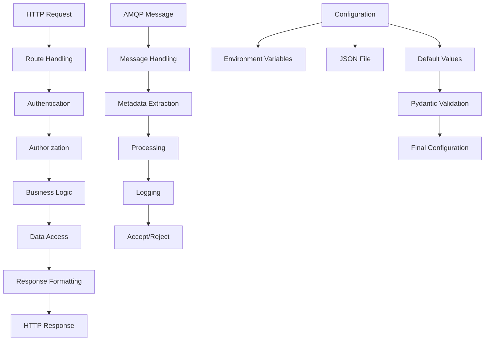
```mermaid
flowchart TD
    A[HTTP Request] --> B[Route Handling]
    B --> C[Authentication]
    C --> D[Authorization]
    D --> E[Business Logic]
    E --> F[Data Access]
    F --> G[Response Formatting]
    G --> H[HTTP Response]
    
    I[AMQP Message] --> J[Message Handling]
    J --> K[Metadata Extraction]
    K --> L[Processing]
    L --> M[Logging]
    M --> N[Accept/Reject]
    
    O[Configuration] --> P[Environment Variables]
    O --> Q[JSON File]
    O --> R[Default Values]
    R --> S[Pydantic Validation]
    S --> T[Final Configuration]
```

## 🔄 Error Handling Architecture

### 🛑 Error Flow Architecture

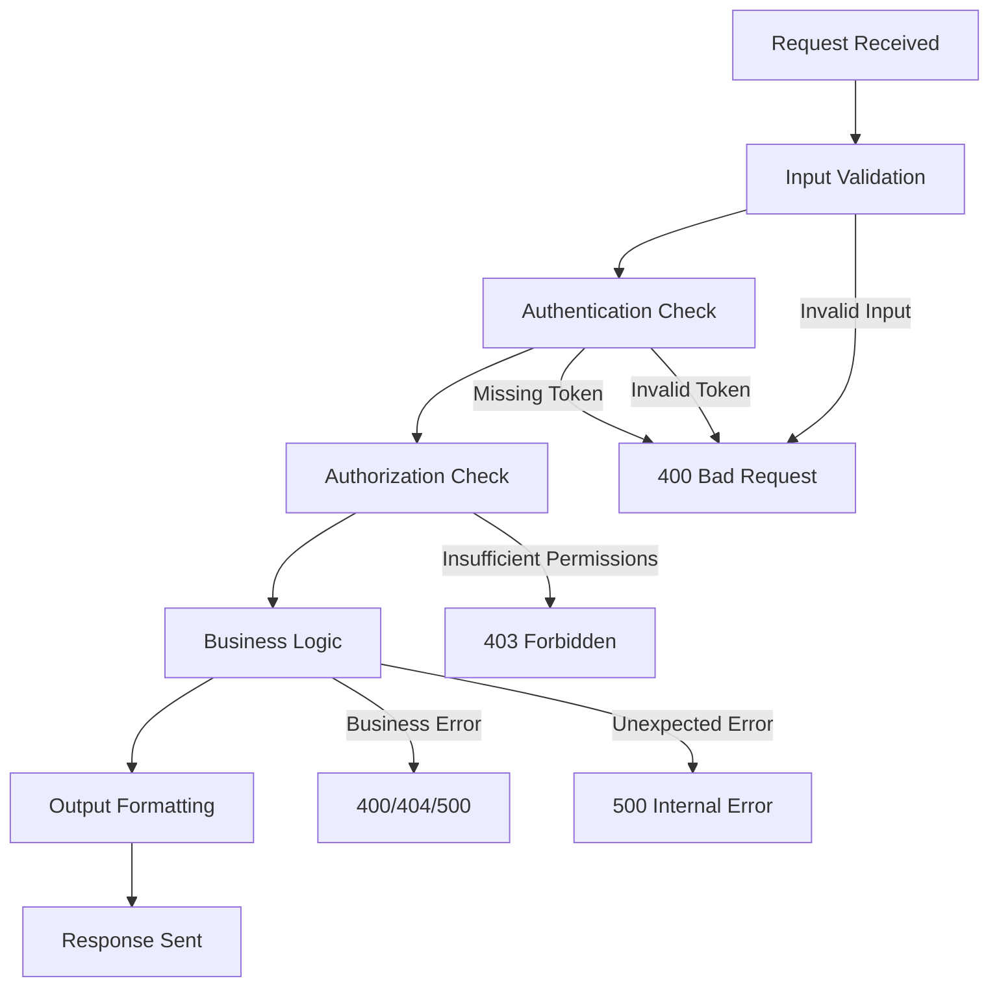
```mermaid
flowchart TD
    A[Request Received] --> B[Input Validation]
    B --> C[Authentication Check]
    C --> D[Authorization Check]
    D --> E[Business Logic]
    E --> F[Output Formatting]
    F --> G[Response Sent]
    
    B -->|Invalid Input| H[400 Bad Request]
    C -->|Missing Token| H
    C -->|Invalid Token| H
    D -->|Insufficient Permissions| I[403 Forbidden]
    E -->|Business Error| J[400/404/500]
    E -->|Unexpected Error| K[500 Internal Error]
```

### 📋 Error Response Architecture

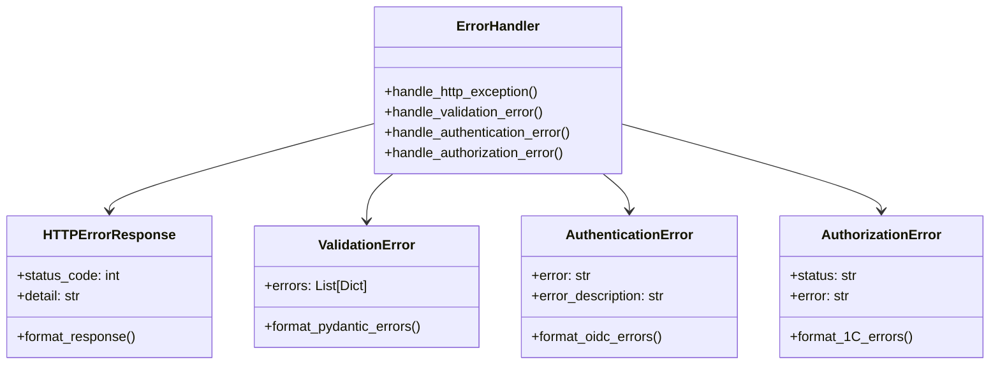
```mermaid
classDiagram
    class ErrorHandler {
        +handle_http_exception()
        +handle_validation_error()
        +handle_authentication_error()
        +handle_authorization_error()
    }
    
    class HTTPErrorResponse {
        +status_code: int
        +detail: str
        +format_response()
    }
    
    class ValidationError {
        +errors: List[Dict]
        +format_pydantic_errors()
    }
    
    class AuthenticationError {
        +error: str
        +error_description: str
        +format_oidc_errors()
    }
    
    class AuthorizationError {
        +status: str
        +error: str
        +format_1C_errors()
    }
    
    ErrorHandler --> HTTPErrorResponse
    ErrorHandler --> ValidationError
    ErrorHandler --> AuthenticationError
    ErrorHandler --> AuthorizationError
```

## 🧪 Testing Architecture

### 📋 Test Architecture Diagram

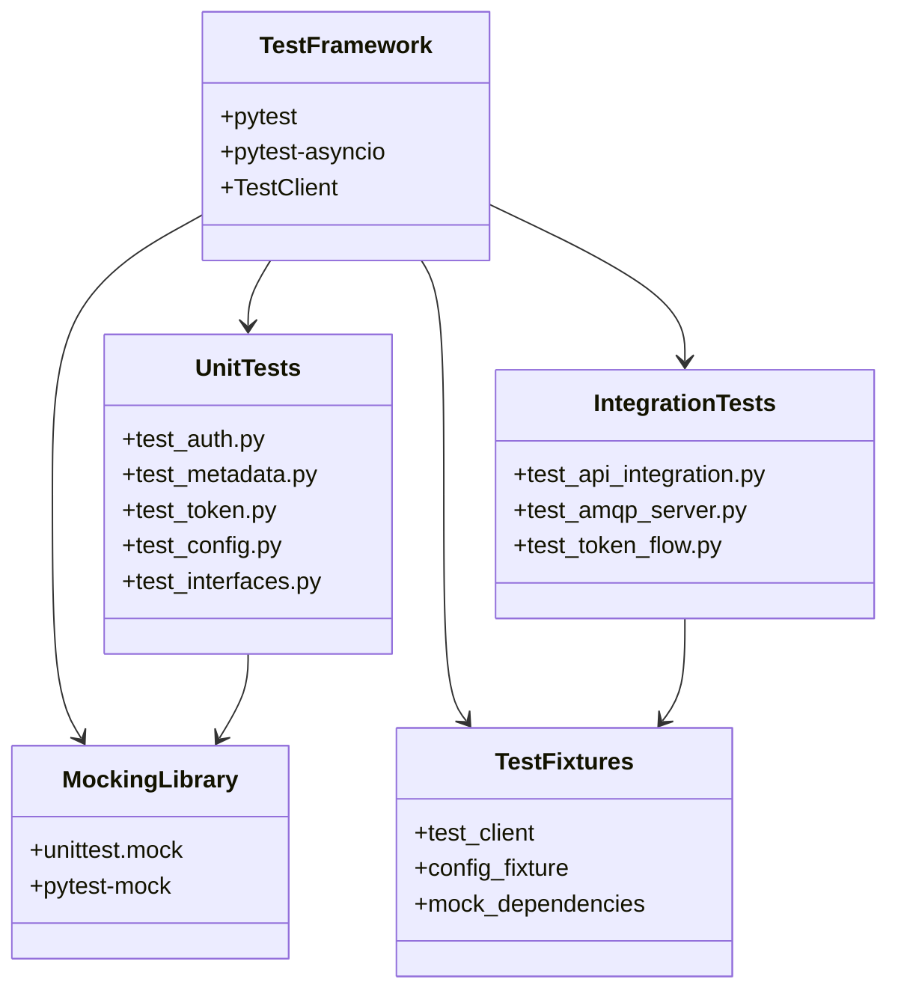
```mermaid
classDiagram
    class TestFramework {
        +pytest
        +pytest-asyncio
        +TestClient
    }
    
    class UnitTests {
        +test_auth.py
        +test_metadata.py
        +test_token.py
        +test_config.py
        +test_interfaces.py
    }
    
    class IntegrationTests {
        +test_api_integration.py
        +test_amqp_server.py
        +test_token_flow.py
    }
    
    class TestFixtures {
        +test_client
        +config_fixture
        +mock_dependencies
    }
    
    class MockingLibrary {
        +unittest.mock
        +pytest-mock
    }
    
    TestFramework --> UnitTests
    TestFramework --> IntegrationTests
    TestFramework --> TestFixtures
    TestFramework --> MockingLibrary
    
    UnitTests --> MockingLibrary
    IntegrationTests --> TestFixtures
```

### 🔄 Test Execution Flow

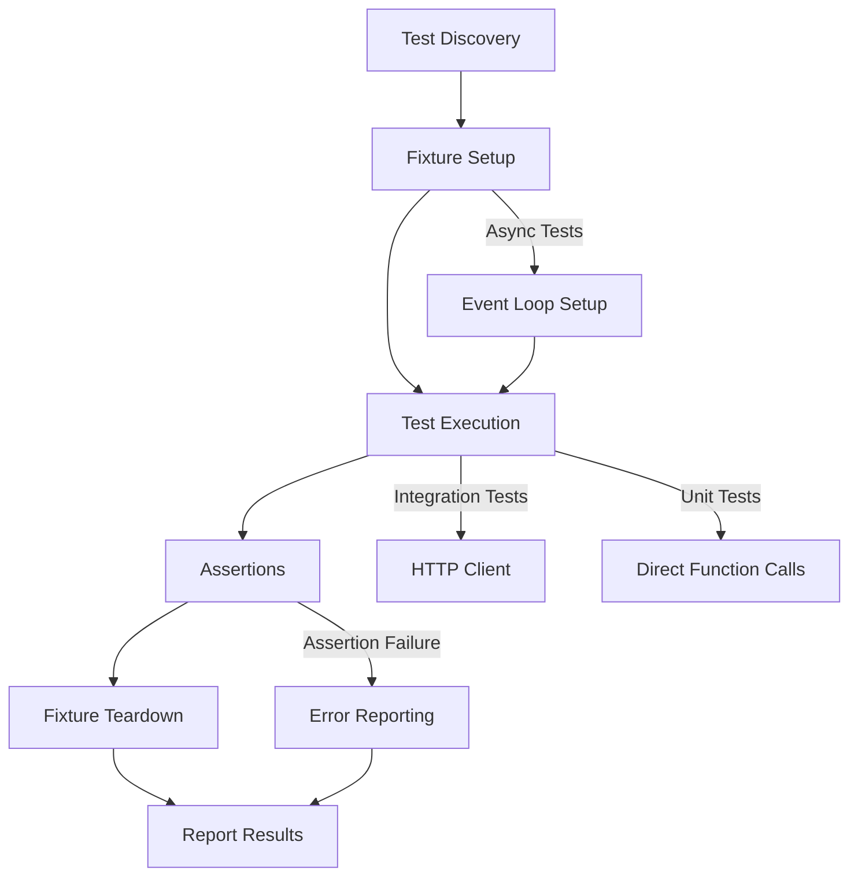
```mermaid
flowchart TD
    A[Test Discovery] --> B[Fixture Setup]
    B --> C[Test Execution]
    C --> D[Assertions]
    D --> E[Fixture Teardown]
    E --> F[Report Results]
    
    B -->|Async Tests| G[Event Loop Setup]
    G --> C
    
    C -->|Integration Tests| H[HTTP Client]
    C -->|Unit Tests| I[Direct Function Calls]
    
    D -->|Assertion Failure| J[Error Reporting]
    J --> F
```

## 🚀 Performance Architecture

### 📊 Performance Flow Architecture

```mermaid
flowchart TD
    A[Request Arrival] --> B[Connection Pool]
    B --> C[Request Routing]
    C --> D[Middleware Processing]
    D --> E[Endpoint Execution]
    E --> F[Business Logic]
    F --> G[Response Generation]
    G --> H[Connection Return]
    H --> I[Response Sent]
    
    B -->|New Connection| J[Connection Establishment]
    J --> B
    
    E -->|Token Generation| K[JWT Signing]
    K --> F
    
    F -->|AMQP Processing| L[Message Handling]
    L --> F
```

### 📈 Bottleneck Analysis

```mermaid
classDiagram
    class PerformanceAnalyzer {
        +identify_bottlenecks()
        +profile_endpoints()
        +analyze_database_queries()
        +review_network_calls()
    }
    
    class Bottleneck {
        +JWT_Signing
        +AMQP_Message_Processing
        +Configuration_Loading
        +Database_Queries
        +Network_Calls
    }
    
    class OptimizationStrategy {
        +Caching
        +Async_IO
        +Connection_Pooling
        +Query_Optimization
        +Load_Balancing
    }
    
    PerformanceAnalyzer --> Bottleneck
    PerformanceAnalyzer --> OptimizationStrategy
```

## 🔐 Security Architecture

### 🛡️ Security Layer Architecture

```mermaid
classDiagram
    class SecurityLayer {
        +Authentication
        +Authorization
        +Data_Validation
        +Encryption
        +Logging
    }
    
    class Authentication {
        +JWT_Token_Validation
        +Client_Credentials
        +RSA_Signing
    }
    
    class Authorization {
        +Role_Based_Access
        +Resource_Permissions
        +Audience_Validation
    }
    
    class DataValidation {
        +Input_Sanitization
        +Pydantic_Validation
        +Type_Checking
    }
    
    class Encryption {
        +RSA_Key_Management
        +JWT_Signing
        +Secure_Storage
    }
    
    class Logging {
        +Request_Logging
        +Error_Logging
        +Security_Event_Logging
    }
    
    SecurityLayer --> Authentication
    SecurityLayer --> Authorization
    SecurityLayer --> DataValidation
    SecurityLayer --> Encryption
    SecurityLayer --> Logging
```

### 🔒 Security Flow Architecture

```mermaid
flowchart TD
    A[Incoming Request] --> B[SSL/TLS Termination]
    B --> C[Request Validation]
    C --> D[Authentication]
    D --> E[Authorization]
    E --> F[Data Processing]
    F --> G[Response Generation]
    G --> H[Response Validation]
    H --> I[Outgoing Response]
    
    B -->|No TLS| J[Plain HTTP]
    J --> C
    
    D -->|JWT Token| K[Token Verification]
    K --> L[Signature Check]
    L --> M[Audience Check]
    M --> E
    
    E -->|Role Check| N[Permission Validation]
    N --> F
```

## 📚 Documentation Architecture

### 📋 Documentation Structure

```mermaid
mindmap
    root
        README.md
            Overview
            Features
            Architecture
            Installation
            Configuration
            API Endpoints
            Security
            Development
            Docker Support
            Use Cases
            Protocol Compatibility
            Contributing
            Additional Resources
            Project Completion Status
        
        zed_agent_notes.md
            Project Overview
            Architecture
            Components Analysis
            Development Setup
            Security Considerations
            Type System
            Deployment
            Configuration Options
            Status and Roadmap
            Implementation Details
            Token Generation Process
            AMQP Message Handling
            Configuration Flow
            Test Strategy
            Documentation Resources
            Useful Commands
            Project Insights
        
        docs/protocol.md
            Protocol Analysis
            OIDC Flow
            JWT Structure
            Metadata Format
            Error Responses
            Request/Response Examples
            1C Compatibility Notes
        
        todo.md
            Roadmap
            Future Improvements
            Security Enhancements
            Message Processing
            Monitoring and Metrics
            Logging Improvements
            Configuration UI
            Swagger Documentation
            Docker Enhancements
        
        DOCKER_README.md
            Docker Overview
            Quick Start
            Configuration
            Key Features
            Development Mode
            Production Deployment
            Health Checks
            Logging
            Troubleshooting
            Advanced Configuration
        
        TESTING_SUMMARY.md
            Test Coverage
            Test Structure
            Test Results
            Test Execution
            Code Quality
            Continuous Integration
            Test Automation
            Test Strategy
            Test Data
            Test Environment
            Test Metrics
        
        SUMMARY.md
            Project Overview
            Technical Architecture
            Implemented Features
            Feature Breakdown
            Testing Coverage
            Docker Deployment
            Performance Characteristics
            Project Completion Status
            Use Cases
            Key Metrics
            Integration Points
            Project Success Criteria
            Documentation Resources
            Getting Started
            Support and Resources
        
        PROJECT_MAP.md
            System Architecture
            Component Breakdown
            Data Flow Diagrams
            Module Architecture
            Technical Implementation
            File System Architecture
            Integration Architecture
            Deployment Architecture
            Data Model Architecture
            Error Handling Architecture
            Testing Architecture
            Performance Architecture
            Security Architecture
            Documentation Architecture
        
        COMMAND_REFERENCE.md
            Development Commands
            Testing Commands
            Docker Commands
            API Testing Commands
            Debugging Commands
            Configuration Commands
            Utility Commands
        
        NAVIGATION.md
            Quick Navigation
            File Navigation
            Search Strategies
            Common Tasks
            Debugging Tips
            Performance Optimization
            Documentation Strategy
            Continuous Integration
            Project Completion Checklist
            Pro Tips
            Support Resources
        
        AGENT_GUIDE.md
            Project Overview
            Quick Navigation Commands
            Code Search Patterns
            Testing Commands
            Development Commands
            Docker Commands
            API Testing
            File Navigation Guide
            Search Strategies
            Understanding Code Flow
            Common Tasks
            Debugging Tips
            Performance Optimization
            Documentation Strategy
            Continuous Integration
            Project Completion Checklist
            Pro Tips
            Support Resources
        
        AGENT_WORKFLOW.md
            Quick Start
            Project Architecture
            Task-Specific Workflows
            Development Workflow
            Tool Integration
            Pro Tips
            Task Completion Checklist
            Support and Resources
```

## 🔄 Integration Points Summary

### 🔌 System Integration Map

```mermaid
flowchart TD
    A[1C Enterprise] -->|OIDC Auth| B[PyESB HTTP API]
    A -->|AMQP Messages| C[PyESB AMQP Server]
    
    B -->|JWT Tokens| A
    B -->|Metadata| A
    
    C -->|Processed Messages| D[Message Logs]
    
    E[Development Environment] -->|Config| F[Configuration System]
    F -->|Settings| B
    F -->|Settings| C
    
    G[Monitoring Tools] -->|Metrics| B
    G -->|Logs| C
    
    H[Docker Orchestration] -->|Deployment| I[Docker Container]
    I -->|Runs| B
    I -->|Runs| C
    I -->|Mounts| J[Key Files]
    I -->|Reads| F
```

## 🏁 Conclusion

This architecture map provides a **comprehensive visual representation** of the PyESB project structure, components, and data flows. The diagrams illustrate:

1. **System Architecture** - High-level component relationships
2. **Data Flows** - Request processing and message handling
3. **Module Structure** - Code organization and dependencies
4. **Technical Implementation** - Detailed component architectures
5. **Integration Points** - External system connections
6. **Deployment Architecture** - Docker and containerization
7. **Data Models** - Type system and validation
8. **Error Handling** - Exception management and responses
9. **Testing Architecture** - Test organization and execution
10. **Performance** - Bottleneck analysis and optimization
11. **Security** - Authentication, authorization, and encryption
12. **Documentation** - Documentation structure and organization

Use these diagrams to quickly understand any aspect of the PyESB architecture and locate specific components or data flows.

---

**Architecture Version**: 1.0.0
**Last Updated**: 2024-01-01
**Maintainer**: Development Team

For architecture-specific questions, refer to the appropriate diagram section or consult the detailed documentation files.
