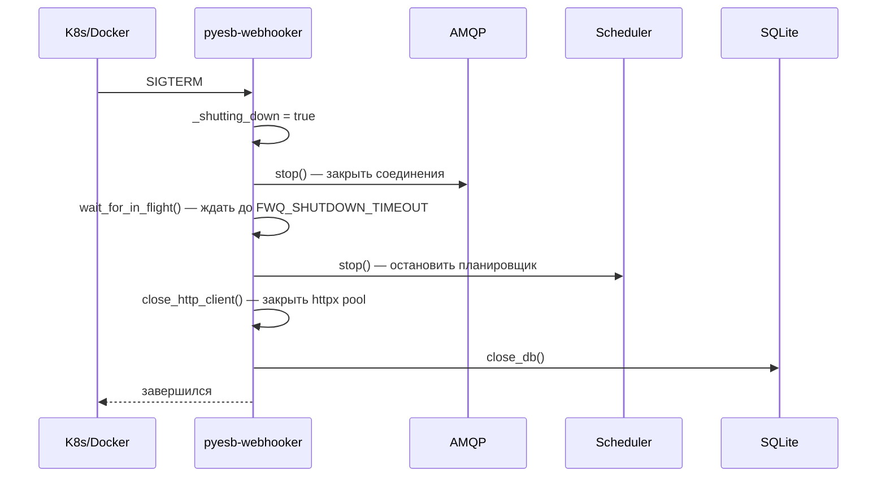

# 🚀 pyesb-webhooker

### Webhook Delivery Service — доставщик уведомлений

**Принимает, хранит, доставляет.**  
Контейнерный микросервис, который забирает уведомления из 1С (по AMQP) или HTTP,  
и аккуратно доставляет их на внешние URL — с повторными попытками, защитой от лавины  
и полным JSONL-логом каждого чиха.

---

## 🧠 Зачем это нужно?

У вас есть 1С, которая умеет кричать в шину (ESB).  
У вас есть внешние сервисы, которые умеют принимать вебхуки.  

**pyesb-webhooker** — это мост:

```
1С ──AMQP──▶ pyesb-webhooker ──HTTP──▶ Ваш сервис
                │
                └──▶ JSONL-лог (каждое событие)
```

Не нужно писать свой scheduler, городить очереди,  
отлавливать SIGTERM и прикручивать метрики.  
**Всё уже есть.** Просто запустите контейнер.

---

## ✨ Возможности

| | Возможность | Как работает |
|---|---|---|
| 🔁 | **Retry до TTL** | APScheduler `IntervalTrigger` с end_time. Никаких счётчиков — время решает. |
| 🛡️ | **Circuit Breaker** | cashews in-memory: >=10 ошибок на URL за минуту → пауза 5 минут. |
| 🧵 | **Concurrency Guard** | Семафор на количество одновременных HTTP-запросов (по умолч. 50). |
| 📦 | **Shared HTTP Pool** | Один `httpx.AsyncClient` на все доставки — никаких TCP-рукопожатий на каждый запрос. |
| 🧹 | **DLQ (Dead Letter Queue)** | `DeliveryExpiredEvent` при истечении TTL — мониторинг знает, что сообщение «умерло». |
| 🔐 | **PII Masking** | Authorization, пароли, паспорта, ИНН — всё маскируется в логах до записи. |
| 📋 | **JSONL-логи** | structlog + QueueHandler (неблокирующий). Каждое событие — валидный JSON в stdout. |
| 💀 | **Graceful Shutdown** | SIGTERM → доставляем in-flight → останавливаем scheduler → закрываем соединения. |
| ❤️ | **Health Checks** | `/health/live`, `/health/ready` — готово для K8s liveness/readiness probes. |
| 📊 | **Metrics** | `/metrics` — in-memory счётчики с histogram длительности. |
| 🔍 | **Trace ID** | Сквозной идентификатор через contextvars — во всех логах. |
| 🦀 | **AMQP** | Rust-based `pyesb-amqp` — быстро и надёжно. |

---

## 🐳 Быстрый старт

```bash
# Сборка
docker build -t pyesb-webhooker:latest .

# Запуск
docker run --rm -p 8000:8000 pyesb-webhooker:latest

# Проверка
curl http://localhost:8000/health
# → {"status":"ok","scheduler":true,"in_flight":0,"shutting_down":false}
```

### Отправить тестовое уведомление

```bash
curl -X POST http://localhost:8000 \
  -H "Content-Type: application/json" \
  -d '{
    "url": "https://httpbin.org/post",
    "body": {"hello": "world"},
    "timeout": 30,
    "pause": 10,
    "ttl": 300
  }'
# → 204 No Content
```

Смотреть логи:

```bash
docker logs -f <container_id> | jq '.'
```

---

## 🏗️ Архитектура

### Container-first

Приложение **создано для контейнера** и не предназначено для запуска на голом железе:

```
┌─────────────────────────────────────────────────┐
│  🐳 pyesb-webhooker                             │
│                                                 │
│  FastAPI ─── APScheduler ─── httpx (pool)      │
│     │              │              │             │
│     ▼              ▼              ▼             │
│  /health      IntervalTrigger  HTTP POST       │
│  /metrics     SQLite store    Circuit Breaker  │
│  POST /                                        │
│     │                                           │
│  pyesb-amqp (Rust)                             │
│     │                                           │
│     ▼                                           │
│  AMQP (из 1С)                                   │
└─────────────────────────────────────────────────┘
```

- **Single-process** — `workers=1`, никого кроме главного процесса
- **Non-root** — runtime под `app:app` (uid 1001)
- **Multi-stage build** — минимальный образ, только venv + код
- **stdout logging** — Docker забирает логи, ротация не требуется

### Поток уведомления

```
 1С ──AMQP──▶ pyesb-amqp ──▶ amqp_handler() ──▶ APScheduler ──▶ HTTP POST ──▶ Внешний URL
                  │                                        │
                  ▼                                        ▼
            PayloadReceived                        JSONL-лог (stdout)
```

```
 HTTP POST / ──▶ main.py ──▶ APScheduler ──▶ HTTP POST ──▶ Внешний URL
                    │
                    ▼
              PayloadReceived
              JSONL-лог (stdout)
```

### Жизненный цикл доставки

```
Получение
    │
    ▼
┌─────────────────────┐
│  IntervalTrigger    │ ◀── повтор каждые `pause` секунд
│  (start → end=TTL)  │
└────────┬────────────┘
         │
    ┌────▼────┐
    │  HTTP   │
    │  POST   │
    └────┬────┘
         │
    ┌────▼────┐       ┌──────────────┐
    │  2xx?   │──НЕТ──▶  Circuit     │──открыт──▶ ждём половину TTL
    └────┬────┘       │  Breaker?    │
         │            └──────────────┘
         │ДА                │
    ┌────▼────┐        ┌────▼───────────┐
    │  ✅     │        │  end_time ≥    │
    │ Success │        │  now?          │
    │         │        └────┬───────────┘
    │ remove  │        ┌────▼────┐ ┌──────────────┐
    │ schedule│        │   ДА    │ │    НЕТ       │
    └─────────┘        │ retry   │ │  DLQ ☠️      │
                       └─────────┘ │ DeliveryExpired│
                                   └──────────────┘
```

### Graceful Shutdown



---

## ⚙️ Конфигурация

Всё через переменные окружения с префиксом `FWQ_` (12-factor app).

### Сервер

| Переменная | По умолчанию | Описание |
|---|---|---|
| `FWQ_BIND_HOST` | `0.0.0.0` | Адрес для привязки |
| `FWQ_BIND_PORT` | `8000` | Порт |

### Доставка

| Переменная | По умолчанию | Описание |
|---|---|---|
| `FWQ_MAX_CONCURRENT_DELIVERIES` | `50` | Одновременных HTTP-запросов (семафор) |
| `FWQ_SCHEDULER_MAX_CONCURRENT` | `20` | `max_concurrent_jobs` APScheduler |
| `FWQ_SHUTDOWN_TIMEOUT` | `30` | Секунд ожидания in-flight при shutdown |
| `FWQ_DEFAULT_PAUSE` | `10` | Пауза между retry (сек) |
| `FWQ_DEFAULT_TTL` | `300` | TTL доставки (сек) |
| `FWQ_DEFAULT_TIMEOUT` | `30` | HTTP-таймаут (сек) |

### Логирование и безопасность

| Переменная | По умолчанию | Описание |
|---|---|---|
| `FWQ_LOG_QUEUE_MAXSIZE` | `5000` | Размер очереди QueueHandler |
| `FWQ_LOG_BODY_MAX_CHARS` | `4096` | Макс. длина тела запроса в логах |
| `FWQ_LOG_RESPONSE_BODY_MAX_CHARS` | `4096` | Макс. длина тела ответа в логах |
| `FWQ_PII_BODY_KEYS` | `password,secret,token,passport,phone,email,inn,snils,credit_card,birth_date` | Ключи JSON для маскировки в логах |

### База данных

| Переменная | По умолчанию | Описание |
|---|---|---|
| `FWQ_DATABASE_URL` | `sqlite+aiosqlite:///data.db` | Async SQLAlchemy DSN (только для APScheduler) |

---

## 📡 API

| Метод | Путь | Описание |
|---|---|---|
| `POST` | `/` | 🔔 Отправить уведомление на доставку |
| `GET` | `/health` | ❤️ Liveness probe |
| `GET` | `/health/live` | ❤️ Liveness probe |
| `GET` | `/health/ready` | ❤️ Readiness probe |
| `GET` | `/metrics` | 📊 Метрики доставки |
| `GET` | `/metrics/json` | 📊 То же, в JSON |
| `GET` | `/docs` | 📖 Swagger UI |

### Пример: отправить уведомление

```json
POST /
{
  "url": "https://example.com/webhook",
  "body": {"order_id": 12345, "status": "paid"},
  "headers": [["Authorization", "Bearer s3cr3t"]],
  "timeout": 30,
  "pause": 10,
  "ttl": 300
}
```

Ответ: `204 No Content`.

**Что произойдёт:**
1. APScheduler создаст задачу → первый POST на `url` **немедленно**
2. При ошибке — повтор через `pause` секунд
3. Через `ttl` секунд — `DeliveryExpiredEvent` (если всё ещё не 2xx)

---

## 🛡️ Безопасность

| Механизм | Детали |
|---|---|
| **Non-root user** | Контейнер работает от `app:app` (uid 1001) |
| **Input validation** | Pydantic `HttpUrl`, `PositiveInt` |
| **Header sanitization** | Authorization, Cookie, X-Api-Key → `***` в логах |
| **Body PII masking** | Настраиваемый список ключей (`FWQ_PII_BODY_KEYS`) → `***` в логах |
| **Circuit Breaker** | Защита целевых серверов от лавины |
| **Trace ID** | Сквозной идентификатор для аудита |

> ⚠️ **Важно:** SSL-верификация отключена (`verify=False`) — требование интеграции с 1С.

---

## 📋 Логирование

Всё пишется в **JSONL** в stdout. Docker сам забирает — никаких файлов, никакой ротации.

Формат каждой записи:

```json
{
  "event": "delivery_attempt",
  "level": "info",
  "dt": "2026-06-26T12:00:00.000000Z",
  "ulid": "01KW1Z2804N3TZGTQVE8255MF9",
  "schedule_id": "delivery_http_abc123",
  "message_id": "550e8400-e29b-41d4-a716-446655440000",
  "trace_id": "660f8400-e29b-41d4-a716-446655440001",
  "destination": "http",
  "url": "https://example.com/webhook",
  "body_size": 42
}
```

Удобно смотреть через `jq`:

```bash
docker logs -f <id> | jq '{event, level, url, duration_ms}'
```

События логирования — это Pydantic-модели с методом `.emit()`:

```python
DeliveryAttemptEvent(
    schedule_id=...,
    destination=...,
    url=...,
).emit()
```

---

## 🧪 Тесты

```bash
# Все тесты
uv run pytest -v

# С coverage
uv run pytest -v --cov=app --cov-report=term-missing

# Конкретный
uv run pytest tests/test_smoke.py -v
```

70 тестов, все проходят.

---

## 📁 Структура проекта

```
pyesb-webhooker/
├── app/
│   ├── __init__.py       # Пакет
│   ├── __main__.py       # Точка входа (aiorun + uvicorn)
│   ├── main.py           # FastAPI app + роуты
│   ├── models.py          # Pydantic модели (PayloadSchema, Message)
│   ├── lifespan.py        # FastAPI lifespan (scheduler + shutdown)
│   ├── delivery.py        # ❤️ Ядро: HTTP-доставка с retry
│   ├── middleware.py      # Middleware pipeline (metrics, onion)
│   ├── events.py          # Модели событий логирования
│   ├── log.py             # JSONL-лог (structlog + QueueHandler)
│   ├── config.py          # Конфигурация (frozen dataclass, FWQ_*)
│   ├── context.py         # ContextVar для message_id / trace_id
│   ├── router.py          # Маршрутизация (trace_id, заголовки)
│   ├── tasks.py           # Безопасное создание asyncio-задач
│   └── database.py        # Async SQLite engine
├── tests/                 # 70 тестов
├── Dockerfile             # Multi-stage, non-root, OCI labels
├── AUDIT.md               # Аудит безопасности
├── pyproject.toml         # Зависимости + uv.lock
└── README.md              # ← вы здесь
```

---

## 🚢 Запуск в Kubernetes

```yaml
apiVersion: apps/v1
kind: Deployment
metadata:
  name: pyesb-webhooker
spec:
  replicas: 1  # workers=1, не масштабировать
  template:
    spec:
      containers:
        - name: webhooker
          image: pyesb-webhooker:latest
          ports:
            - containerPort: 8000
          env:
            - name: FWQ_DATABASE_URL
              value: "sqlite+aiosqlite:///data/pyesb.db"
            - name: FWQ_PII_BODY_KEYS
              value: "password,token,secret"
          livenessProbe:
            httpGet: { path: /health/live, port: 8000 }
            initialDelaySeconds: 10
          readinessProbe:
            httpGet: { path: /health/ready, port: 8000 }
            initialDelaySeconds: 5
          volumeMounts:
            - name: data
              mountPath: /app/data
      volumes:
        - name: data
          emptyDir: {}
```

---

## 🧑‍💻 Разработка

```bash
uv sync --group test
uv run uvicorn app.main:app --reload --host=0.0.0.0 --port=8000
```

Добавление нового канала:

```python
# main.py
ChannelDesription(
    access="WRITE_ONLY",
    process="my_process",
    channel="my_channel",
    destination="my_queue",
    process_description="...",
    channel_description="...",
),
```

---

## 📜 Лицензия

MIT

---

**pyesb-webhooker** — доставляем уведомления с заботой. 🚀
