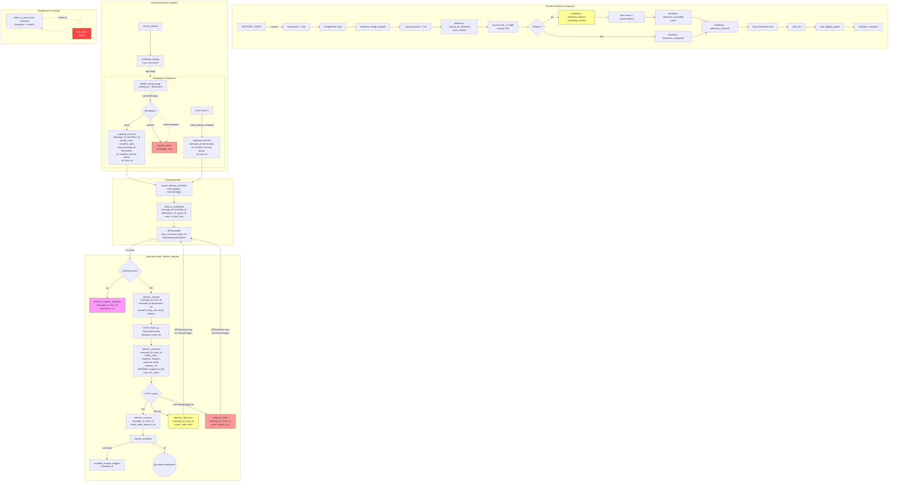
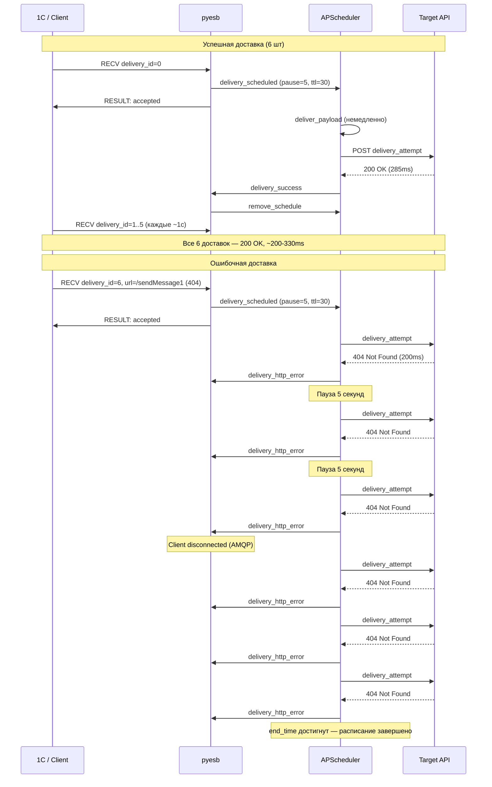

# Система логирования pyesb

Структурированное логирование через **structlog** + **stdlib logging**.
Все события пишутся в **JSONL** (по одной JSON-строке на событие).
Для неблокирующей записи используется `QueueHandler` + `QueueListener`.

## Архитектура потока логов

```
Application code
    |
    v
structlog (.info, .warning, .error, .exception)
    |  processors: filter_by_level -> add_log_level -> TimeStamper -> StackInfoRenderer
    |              -> set_exc_info -> _add_context_vars -> JSONRenderer
    v
stdlib logging (logging.getLogger().info)
    |
    v
QueueHandler (queue.Queue, maxsize=5000)   <- не блокирует event loop
    |
    v [фоновый поток QueueListener]
    |
    v
StreamHandler + JsonlFormatter
    |
    v
stdout (fd 1)
```

Параллельный канал -- **stderr redirect**:
```
pyesb-amqp Rust tracing -> stderr (fd 2, pipe) -> asyncio task: os.read()
    -> _async_print(os.write, fd 1) -> stdout
```

---

## Pydantic-модели событий (валидация)

Все события, содержащие данные, проходят через **Pydantic-модели**
перед записью в лог.

Поля, общие для нескольких событий, вынесены в **базовые классы-примеси**
и переиспользуются через множественное наследование — ни одно поле
не определено более чем в одном месте:

```
LogEvent (база: extra=forbid, validate_default=True)
│
├── ScheduleRef      (schedule_id)              ← единственное определение
├── TargetRef        (destination, url)          ← единственное определение
├── MessageRef       (message_id, trace_id)       ← единственное определение
│
├── DeliveryEventBase = ScheduleRef + TargetRef        ← без своих полей
│   ├── DeliveryAttemptEvent       + headers, body_size, body, timeout
│   ├── DeliveryResponseEvent      + status_code, response_headers, …
│   ├── DeliverySuccessEvent       + status_code, duration_ms
│   ├── DeliveryHttpErrorEvent     + status_code, error
│   ├── DeliveryFailedEvent        + error, duration_ms
│   └── DeliveryScheduledEvent     + MessageRef + pause, ttl, end_time
│
├── DeliverySkippedShutdownEvent = MessageRef + TargetRef  ← без своих полей
├── ScheduleRemoveSkippedEvent    = ScheduleRef             ← без своих полей
├── PayloadReceivedEvent          = MessageRef + TargetRef + ScheduleRef
│   └── PayloadReceivedAMQPEvent  + correlation_id, sender_code, …
│
└── Остальные (HandlerFailedEvent, …) — standalone, нет пересечений
```

**Ключевой принцип:** каждое поле определено ровно один раз.
Если завтра ``destination`` переименуется в ``queue_name`` —
достаточно изменить одно поле в ``TargetRef``.

**Запись в лог** — метод ``.emit()`` на самой модели:

1. ``ModelClass(...)`` — Pydantic валидирует поля.
2. ``.emit()`` — ``model_dump()`` → ``structlog``.
3. Имя события и уровень — из ClassVar ``_event_name`` / ``_level`` на модели.

**Преимущества:**

- Описка в имени поля → ``ValidationError`` (``extra=forbid``).
- Новое событие = новая модель = вся картина полей в одном месте.
- При изменении модели IDE подсветит все ``emit_*`` с невалидными аргументами.

---

## Полный перечень событий

### Жизненный цикл сервиса (lifespan)

| № | Событие | Уровень | Описание | Где | Поля |
|---|---------|---------|----------|-----|------|
| 1 | `service_startup` | `info` | **Приложение стартовало.** FastAPI lifespan начался, логирование настроено. Ожидаем AMQP-соединения и HTTP-запросы. | `main.py:95` | *(нет)* |
| 2 | `scheduler_started` | `info` | **APScheduler запущен.** Фоновый планировщик готов принимать расписания доставки. Max concurrent jobs = 20. | `main.py:120` | `max_concurrent` |
| 3 | `shutdown: complete` | `info` | **Завершение успешно.** Все компоненты (AMQP, диспетчер, APScheduler, БД) остановлены. Последняя запись в логе перед exit. | `main.py:196` | *(нет)* |

### Входящие сообщения (AMQP / HTTP)

| № | Событие | Уровень | Описание | Где | Поля |
|---|---------|---------|----------|-----|------|
| 4 | `payload_received` (AMQP) | `info` | **Новое сообщение из 1С.** AMQP-сообщение успешно распарсено в PayloadSchema. Создано расписание доставки на внешний URL. Если `trace_id` не был в теле, проверен заголовок `X-Trace-Id`. | `main.py:160` | `message_id`, `correlation_id`, `sender_code`, `recipient_code`, `integ_message_id`, `destination`, `url`, `headers`, `timeout`, `pause`, `ttl`, `trace_id`, `schedule_id` |
| 5 | `payload_received` (HTTP) | `info` | **Новый HTTP-запрос.** POST `/` от внешней системы. Сгенерирован `message_id` (UUIDv4), создано расписание доставки. | `main.py:314` | `message_id`, `destination`, `url`, `headers`, `timeout`, `pause`, `ttl`, `trace_id`, `schedule_id` |
| 6 | `handler_failed` | `error` | **Ошибка парсинга.** AMQP-сообщение не удалось распарсить (невалидный JSON, не хватает полей). Сообщение отклонено, `return False`. | `main.py:177` | `destination`, `error` |

### Планирование доставки

| № | Событие | Уровень | Описание | Где | Поля |
|---|---------|---------|----------|-----|------|
| 7 | `delivery_scheduled` | `info` | **Расписание создано.** APScheduler будет делать HTTP POST на `url` каждые `pause` секунд до `end_time` (текущее время + `ttl`). Первая попытка — немедленно. | `delivery.py:263` | `message_id`, `schedule_id`, `destination`, `url`, `pause`, `ttl`, `trace_id`, `end_time` |

### Цикл доставки (один вызов `deliver_payload`)

| № | Событие | Уровень | Описание | Где | Поля |
|---|---------|---------|----------|-----|------|
| 8 | `delivery_skipped_shutdown` | `warning` | **Доставка отменена.** Приложение выключается (`_shutting_down = True`), HTTP-запрос не выполнен. Сообщение останется неотправленным (данные в APScheduler могут быть потеряны при stop). | `delivery.py:82` | `message_id`, `trace_id`, `destination`, `url` |
| 9 | `delivery_attempt` | `info` | **Попытка доставки.** Начинаем HTTP POST на `url`. Зафиксированы: тело запроса (`body`), его размер (`body_size`), таймаут (`timeout`). | `delivery.py:107` | `message_id`, `trace_id`, `schedule_id`, `destination`, `url`, `headers`, `body_size`, `body`, `timeout` |
| 10 | `delivery_response` | `info` | **Ответ получен.** HTTP-статус, заголовки и тело ответа. **Логируется ДО `raise_for_status`** — это сознательное решение: даже при 4xx/5xx ответ сохраняется в логе для аудита. | `delivery.py:137` | `message_id`, `trace_id`, `schedule_id`, `destination`, `url`, `status_code`, `response_headers`, `response_body`, `duration_ms` |
| 11 | `delivery_success` | `info` | **Доставка успешна.** HTTP 2xx. Расписание удаляется — повторных попыток не будет. Для мониторинга: считайте этот event как "delivered OK". | `delivery.py:172` | `message_id`, `trace_id`, `schedule_id`, `destination`, `url`, `status_code`, `duration_ms` |
| 12 | `delivery_http_error` | `warning` | **HTTP-ошибка.** Сервер вернул 4xx/5xx. APScheduler повторит запрос через `pause` секунд. Если ошибка постоянная (например 404), попытки будут до TTL. | `delivery.py:149` | `message_id`, `trace_id`, `schedule_id`, `destination`, `url`, `status_code`, `error` |
| 13 | `delivery_failed` | `error` | **Сетевая ошибка / таймаут.** Целевой сервер недоступен, DNS не резолвится, истек таймаут. APScheduler повторит попытку. | `delivery.py:161` | `message_id`, `trace_id`, `schedule_id`, `destination`, `url`, `error`, `duration_ms` |
| 14 | `schedule_remove_skipped` | `debug` | **Расписание уже удалено.** Гонка при удалении — concurrent remove. Можно игнорировать, это штатная ситуация при retry-логике. | `delivery.py:186` | `schedule_id` |

### Завершение работы (shutdown sequence)

| № | Событие | Уровень | Описание | Где | Поля |
|---|---------|---------|----------|-----|------|
| 15 | `shutdown: amqp_stopped` | `info` | **AMQP остановлен.** Новые AMQP-сообщения не принимаются. Флаг `_shutting_down = True` — все последующие вызовы `deliver_payload` будут пропущены. | `main.py:107` | *(нет)* |
| 16 | `shutdown: waiting_for_deliveries` | `info` | **Ожидание доставок.** `count` активных HTTP-запросов выполняются. Ждём максимум `timeout` секунд. | `delivery.py:206` | `count`, `timeout` |
| 17 | `shutdown: deliveries_timeout` | `warning` | **Таймаут ожидания.** `remaining` задач не завершились за `timeout`. Будет force cancel через `task.cancel()`. | `delivery.py:209` | `remaining`, `timeout` |
| 18 | `shutdown: deliveries_cancelled` | `info` | **Force cancel.** `count` зависших доставок принудительно отменены. Хендлеры получат `CancelledError` (могут закрыть транзакции). | `delivery.py:213` | `count` |
| 19 | `shutdown: deliveries_completed` | `info` | **Штатное завершение.** Все in-flight доставки завершились до таймаута. Ни одна не принудительно отменена. | `delivery.py:215` | *(нет)* |
| 20 | `shutdown: deliveries_resolved` | `info` | **Все задачи разрешены.** Можно останавливать APScheduler и закрывать БД. | `main.py:109` | *(нет)* |

### Системные / аварийные

| № | Событие | Уровень | Описание | Где | Поля |
|---|---------|---------|----------|-----|------|
| 21 | `stderr_to_jsonl_error, restarting` | `exception` | **Ошибка stderr-reader.** Не удалось прочитать stderr от pyesb-amqp (Rust tracing). Task перезапустится через 1 секунду. Если ошибка повторяется — проблемы с pipe. | `log.py:147` | *(stack trace в exception)* |
| 22 | `fatal_error` | `exception` | **Фатальная ошибка.** Приложение не смогло запуститься (startup failure). Процесс завершится с ненулевым кодом. | `__main__.py:62` | `error` |

> **Примечание о `trace_id`:** Поля `message_id` и `trace_id` в событиях `delivery_attempt`, `delivery_response`, `delivery_success`, `delivery_http_error`, `delivery_failed`, `schedule_remove_skipped` не указаны в колонке "Поля", потому что они добавляются **автоматически** через `contextvars` (processor `_add_context_vars`). Другими словами, эти события **всегда содержат** `message_id` и `trace_id` (если trace_id был передан) -- без явного кода.

---

## Общая схема потоков



---

## Семантика delivery_response и порядок логирования

Ключевое архитектурное решение: **`delivery_response` логируется ДО `raise_for_status`**.

```python
# delivery.py:121-134
logger.info("delivery_response", ...)  # - первым
resp.raise_for_status()                # - вторым
```

**Причина:** при HTTP-статусе 4xx/5xx `raise_for_status` бросает исключение,
и объект `Response` теряется. Для финансового аудита нужно доказательство --
каким был ответ сервера, даже если он ошибочный.

---

## Контекстное логирование (contextvars + structlog processor)

В `deliver_payload` `message_id` и `trace_id` фиксируются в `contextvars.ContextVar`:

```python
message_id_var.set(message_id)  # delivery.py:76
trace_id_var.set(trace_id)      # delivery.py:77
```

Structlog processor `_add_context_vars` (`log.py:157-174`) автоматически inject'ит
`message_id` и `trace_id` во **все** structlog-логи внутри доставки без явной
передачи в каждый вызов:

```python
def _add_context_vars(logger, method_name, event_dict):
    msg_id = message_id_var.get(None)
    if msg_id is not None:
        event_dict["message_id"] = msg_id

    tr_id = trace_id_var.get(None)
    if tr_id is not None:
        event_dict["trace_id"] = tr_id

    return event_dict
```

---

## Формат JSONL

Каждая строка -- валидный JSON. Примеры:

```json
{"event": "service_startup", "level": "info", "logger": "lifespan", "timestamp": "2025-06-26T10:00:00"}
{"event": "payload_received", "level": "info", "logger": "lifespan", "message_id": "a1b2c3d4", "destination": "destination1", "url": "http://example.com/hook", "timeout": 30, "pause": 5, "ttl": 300, "trace_id": "my-trace-001", "schedule_id": "delivery_destination1_e5f6g7h8", "timestamp": "2025-06-26T10:00:01"}
{"event": "delivery_scheduled", "level": "info", "logger": "delivery", "message_id": "a1b2c3d4", "schedule_id": "delivery_destination1_e5f6g7h8", "destination": "destination1", "url": "http://example.com/hook", "pause": 5, "ttl": 300, "trace_id": "my-trace-001", "end_time": "2025-06-26T10:05:01+00:00", "timestamp": "2025-06-26T10:00:01"}
{"event": "delivery_attempt", "level": "info", "logger": "delivery", "message_id": "a1b2c3d4", "trace_id": "my-trace-001", "schedule_id": "delivery_destination1_e5f6g7h8", "destination": "destination1", "url": "http://example.com/hook", "body_size": 42, "timeout": 30, "timestamp": "2025-06-26T10:00:01"}
{"event": "delivery_success", "level": "info", "logger": "delivery", "message_id": "a1b2c3d4", "trace_id": "my-trace-001", "schedule_id": "delivery_destination1_e5f6g7h8", "destination": "destination1", "url": "http://example.com/hook", "status_code": 200, "duration_ms": 150, "timestamp": "2025-06-26T10:00:01"}
```

Стандартные поля, добавляемые каждым событием:
- `event` -- имя события (строка)
- `level` -- уровень: `info`, `warning`, `error`, `exception`, `debug`
- `logger` -- имя логера (`lifespan`, `delivery`, `http`, `stderr_redirect`)
- `timestamp` -- ISO-8601 метка времени
- `message_id` -- (через contextvars, если доступен)
- `trace_id` -- (через contextvars, если доступен)

Для uvicorn/stdlib-сообщений без structlog формат оборачивается в `JsonlFormatter`:

```json
{"event": "Uvicorn running on http://0.0.0.0:8000", "level": "info", "logger": "uvicorn", "module": "server", "line": 42, "timestamp": "2025-06-26T10:00:00"}
```

---

## Стандартные поля JSONL

| Поле | Тип | Описание | Источник |
|------|-----|----------|----------|
| `event` | `string` | Имя события | Код приложения |
| `level` | `string` | `info`, `warning`, `error`, `exception`, `debug` | structlog.stdlib.add_log_level |
| `logger` | `string` | Имя логера (модуль) | structlog.stdlib.LoggerFactory |
| `timestamp` | `string` | ISO-8601 | structlog.processors.TimeStamper |
| `message_id` | `string` | UUIDv4 идентификатор сообщения | `delivery.message_id_var` (contextvars) |
| `trace_id` | `string` | UUID сквозной трассировки — из тела сообщения (поле `trace_id`), либо из заголовка `X-Trace-Id`. См. `_resolve_trace_id()` в `main.py` | `app.context.trace_id_var` (contextvars) |

Поля событий -- в таблицах выше (колонка "Поля").

---

## Фильтрация по trace_id

Благодаря автоматическому inject'у через `contextvars`, поле `trace_id`
автоматически появляется во всех событиях внутри `deliver_payload`
(`delivery_attempt`, `delivery_response`, `delivery_success`,
`delivery_http_error`, `delivery_failed`), а также явно передаётся
в `payload_received`, `delivery_scheduled` и `delivery_skipped_shutdown`.

Это позволяет собрать полную историю конкретной доставки одним grep:

```bash
# Все события по trace_id
grep '"trace_id":"<uuid>"' logs/*.jsonl

# Хронология конкретной доставки
grep '"trace_id":"<uuid>"' logs/*.jsonl | jq '.timestamp + " " + .event'
```

**Тип:** `trace_id` -- это **UUID**, валидируется Pydantic (тип `UUID`).
Если поле не передано в теле сообщения (опционально) -- `trace_id` отсутствует
в логах, фильтрация работает только по `message_id`.

**Источник:**
1. Поле `trace_id` в JSON-теле сообщения (``PayloadSchema.trace_id``) — приоритет.
2. Заголовок ``X-Trace-Id`` в AMQP-сообщении (секция ``headers``) — fallback.

Извлечение выполняется в ``main.py:_resolve_trace_id()`` для обоих каналов (AMQP / HTTP).

---

## Хронология доставки (timeline reconstruction)

Ниже — восстановленная последовательность событий для каждого полученного
сообщения из production-лога. Каждый блок — один ``message_id``.



### Таблица хронологии (по логу)

| # | Время (UTC) | message_id | Событие | Статус | Длительность |
|---|-------------|------------|---------|--------|-------------|
| 1 | 08:10:42.475 | `94483a78` | RECV / delivery_scheduled → delivery_attempt | ✅ success | 285ms |
| 2 | 08:11:56.754 | `ed3690d6` | RECV / delivery_scheduled → delivery_attempt | ✅ success | 328ms |
| 3 | 08:11:58.061 | `24f57eac` | RECV / delivery_scheduled → delivery_attempt | ✅ success | 207ms |
| 4 | 08:11:59.064 | `1c12bf16` | RECV / delivery_scheduled → delivery_attempt | ✅ success | 268ms |
| 5 | 08:12:00.171 | `ffcfbcd2` | RECV / delivery_scheduled → delivery_attempt | ✅ success | 278ms |
| 6 | 08:12:01.213 | `f5d07bdb` | RECV / delivery_scheduled → delivery_attempt | ✅ success | 197ms |
| 7 | 08:12:19.604 | `7525c6ed` | RECV / delivery_scheduled → delivery_attempt | ❌ 404 | 200ms |
|   | 08:12:24.725 | `7525c6ed` | retry #2 | ❌ 404 | 182ms |
|   | 08:12:29.724 | `7525c6ed` | retry #3 | ❌ 404 | 243ms |
|   | 08:12:34.724 | `7525c6ed` | retry #4 (client disconnected) | ❌ 404 | 190ms |
|   | 08:12:39.725 | `7525c6ed` | retry #5 | ❌ 404 | 319ms |
|   | 08:12:44.728 | `7525c6ed` | retry #6 | ❌ 404 | 266ms |
|   | 08:12:49.724 | `7525c6ed` | retry #7 | ❌ 404 | 252ms |
|   | 08:12:49.977 | `7525c6ed` | end_time → расписание завершено | — | — |

**Анализ:**
- URL `https://api.telegram.org/.../sendMessage1` (с `1` на конце) всегда возвращает 404 — это ошибка конфигурации отправителя.
- APScheduler исправно делает 7 попыток с интервалом 5с, после чего TTL=30с истекает и расписание завершается.
- После `delivery_id=6` AMQP-клиент отключился, но доставка продолжилась — расписание живёт в APScheduler, оно не привязано к AMQP-соединению.
- Все успешные доставки выполняются за 200-330ms.
